# Архітектура NPUFlow: діаграми компонентів варіантів

Згенеровано `bench/diagrams.py` з `bench/variants.yaml` і `model.py`; не редагувати вручну.
Канали й розміри взято з побудованої моделі для входу 320×256
(ширина × висота); тензори в діаграмах — канали × висота × ширина. Час — медіана
`model_runner --enable-timer` на MaixCAM (CV181x) з `results/speed.jsonl`, «—» — не заміряно.

Позначення: DW — depthwise-separable блок (DW 3×3 → 1×1 → BN → активація), s2 — крок 2,
⊕α — зважена сума з навчуваним α, SE — squeeze-and-excitation, ctx — контекст із f0 через 1×1 conv,
Δflow — приріст потоку, що додається до піднятого потоку попереднього рівня
(на рівнях refine — з навчуваним коефіцієнтом α). Помаранчевим — вузли, що відрізняються від B0.

| Варіант | Зміни відносно B0 | Параметри, M | INT8, мс | mixed, мс |
|---|---|---|---|---|
| [B0](#b0) | базова мережа | 0.502 | 28.89 | 39.95 |
| [S1_no_full_refine](#s1_no_full_refine) | `full_refine: none` | 0.500 | 24.45 | 25.11 |
| [S3_pixelshuffle](#s3_pixelshuffle) | `full_refine: pixelshuffle` | 0.506 | 25.26 | 25.72 |
| [S4_relu](#s4_relu) | `act: relu` | 0.502 | 27.75 | 36.44 |
| [S5_no_se](#s5_no_se) | `use_se: False` | 0.498 | 28.57 | 39.66 |
| [S6_no_pos_enc](#s6_no_pos_enc) | `use_pos_enc: False` | 0.471 | 26.06 | 36.66 |
| [S7_no_l2norm](#s7_no_l2norm) | `use_l2norm: False` | 0.502 | 28.84 | 39.89 |
| [S8_iters1](#s8_iters1) | `iters32: 1`, `iters16: 1` | 0.502 | 28.65 | 39.70 |
| [S9a_corr16_r4](#s9a_corr16_r4) | `r16: 4` | 0.490 | 22.98 | 34.07 |
| [S9b_corr16_1d](#s9b_corr16_1d) | `corr16: 1d` | 0.483 | 19.40 | 30.47 |
| [C1_1d_ps](#c1_1d_ps) | `corr16: 1d`, `full_refine: pixelshuffle` | 0.487 | 15.70 | 16.16 |
| [C2_1d_ps_nopos](#c2_1d_ps_nopos) | `corr16: 1d`, `full_refine: pixelshuffle`, `use_pos_enc: False` | 0.457 | 12.45 | 12.91 |
| [C3_1d_ps_nopos_relu](#c3_1d_ps_nopos_relu) | `corr16: 1d`, `full_refine: pixelshuffle`, `use_pos_enc: False`, `act: relu` | 0.457 | 11.25 | 11.71 |
| [C4_lean_all](#c4_lean_all) | `corr16: 1d`, `full_refine: pixelshuffle`, `use_pos_enc: False`, `act: relu`, `use_se: False`, `use_l2norm: False`, `iters32: 1`, `iters16: 1` | 0.453 | 10.18 | 10.63 |
| [C5_r4_ps_nopos_relu](#c5_r4_ps_nopos_relu) | `r16: 4`, `full_refine: pixelshuffle`, `use_pos_enc: False`, `act: relu` | 0.464 | 15.20 | 15.65 |
| [C6_1d_norefine_nopos_relu](#c6_1d_norefine_nopos_relu) | `corr16: 1d`, `full_refine: none`, `use_pos_enc: False`, `act: relu` | 0.451 | 10.48 | 11.12 |
| [V1_global1d_sa](#v1_global1d_sa) | `corr16: 1d`, `full_refine: pixelshuffle`, `use_pos_enc: False`, `act: relu`, `match8: global1d` | 0.466 | 14.65 | 15.11 |
| [V1b_global1d_sa_loc2](#v1b_global1d_sa_loc2) | `corr16: 1d`, `full_refine: pixelshuffle`, `use_pos_enc: False`, `act: relu`, `match8: global1d`, `match8_local_r: 2` | 0.469 | 19.50 | 19.96 |
| [V1c_global1d_sa_nof1](#v1c_global1d_sa_nof1) | `corr16: 1d`, `full_refine: pixelshuffle`, `use_pos_enc: False`, `act: relu`, `match8: global1d`, `refine8_f1: False` | 0.454 | 14.23 | 14.68 |
| [V1d_global1d_nosa](#v1d_global1d_nosa) | `corr16: 1d`, `full_refine: pixelshuffle`, `use_pos_enc: False`, `act: relu`, `match8: global1d`, `match8_softargmax: False` | 0.466 | 13.34 | 13.80 |
| [V2_kpn_r4](#v2_kpn_r4) | `corr16: 1d`, `full_refine: pixelshuffle`, `use_pos_enc: False`, `act: relu`, `warp8: kpn`, `kpn_r8: 4` | 0.486 | 16.40 | 16.85 |
| [V2b_kpn_r4_global1d](#v2b_kpn_r4_global1d) | `corr16: 1d`, `full_refine: pixelshuffle`, `use_pos_enc: False`, `act: relu`, `warp8: kpn`, `kpn_r8: 4`, `match8: global1d` | 0.495 | 20.01 | 20.48 |
| [V3_dcv_r2_d124](#v3_dcv_r2_d124) | `corr16: 1d`, `full_refine: pixelshuffle`, `use_pos_enc: False`, `act: relu`, `match8: dcv`, `r8: 2`, `dcv_dilations: [1, 2, 4]` | 0.466 | 27.07 | 27.53 |
| [A1_local1d_r4](#a1_local1d_r4) | `corr16: 1d`, `full_refine: pixelshuffle`, `use_pos_enc: False`, `act: relu`, `match8: local1d`, `r8: 4` | 0.459 | 15.97 | 16.41 |
| [V1_B0_global1d_sa](#v1_b0_global1d_sa) | `match8: global1d` | 0.511 | 32.20 | 43.40 |
| [S10_no_s32](#s10_no_s32) | `use_s32: False` | 0.398 | 28.85 | 39.93 |
| [C3n_no_s32](#c3n_no_s32) | `corr16: 1d`, `full_refine: pixelshuffle`, `use_pos_enc: False`, `act: relu`, `use_s32: False` | 0.362 | 10.89 | 11.35 |
| [C5n_no_s32](#c5n_no_s32) | `r16: 4`, `full_refine: pixelshuffle`, `use_pos_enc: False`, `act: relu`, `use_s32: False` | 0.369 | 14.56 | 15.02 |

## B0

Зміни відносно B0: базова мережа. Параметрів: 0.502 M. Час на MaixCAM: INT8 28.89 мс, mixed 39.95 мс.

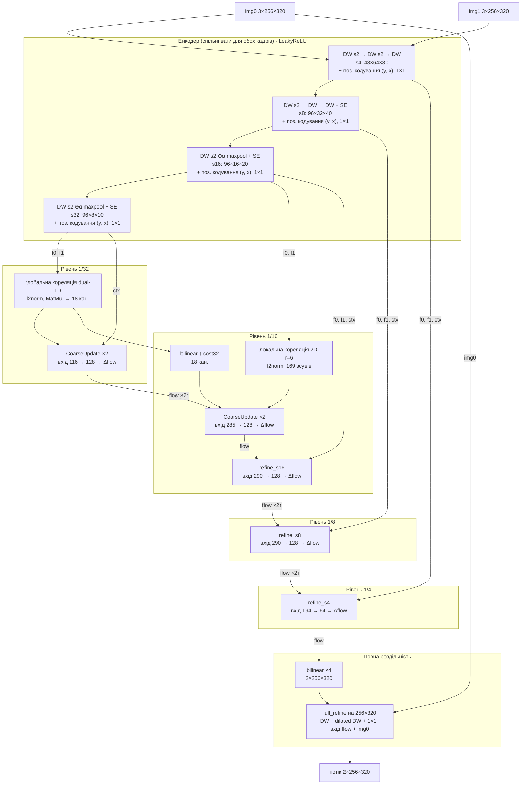
```mermaid
flowchart TB
    I0["img0 3×256×320"]
    I1["img1 3×256×320"]
  subgraph G_enc["Енкодер (спільні ваги для обох кадрів) · LeakyReLU"]
    direction TB
    E4["DW s2 → DW s2 → DW<br/>s4: 48×64×80<br/>+ поз. кодування (y, x), 1×1"]
    E8["DW s2 → DW → DW + SE<br/>s8: 96×32×40<br/>+ поз. кодування (y, x), 1×1"]
    E16["DW s2 ⊕α maxpool + SE<br/>s16: 96×16×20<br/>+ поз. кодування (y, x), 1×1"]
    E32["DW s2 ⊕α maxpool + SE<br/>s32: 96×8×10<br/>+ поз. кодування (y, x), 1×1"]
  end
  subgraph G_s32["Рівень 1/32"]
    direction TB
    C32["глобальна кореляція dual-1D<br/>l2norm, MatMul → 18 кан."]
    U32["CoarseUpdate ×2<br/>вхід 116 → 128 → Δflow"]
  end
  subgraph G_s16["Рівень 1/16"]
    direction TB
    C16["локальна кореляція 2D r=6<br/>l2norm, 169 зсувів"]
    UP32["bilinear ↑ cost32<br/>18 кан."]
    U16["CoarseUpdate ×2<br/>вхід 285 → 128 → Δflow"]
    R16["refine_s16<br/>вхід 290 → 128 → Δflow"]
  end
  subgraph G_s8["Рівень 1/8"]
    direction TB
    R8["refine_s8<br/>вхід 290 → 128 → Δflow"]
  end
  subgraph G_s4["Рівень 1/4"]
    direction TB
    R4["refine_s4<br/>вхід 194 → 64 → Δflow"]
  end
  subgraph G_full["Повна роздільність"]
    direction TB
    UPF["bilinear ×4<br/>2×256×320"]
    FR["full_refine на 256×320<br/>DW + dilated DW + 1×1, вхід flow + img0"]
  end
    OUT["потік 2×256×320"]
  I0 --> E4
  I1 --> E4
  E4 --> E8
  E8 --> E16
  E16 --> E32
  E32 -->|f0, f1| C32
  C32 --> U32
  E32 -->|ctx| U32
  E16 -->|f0, f1| C16
  C16 --> U16
  U16 -->|flow| R16
  E16 -->|f0, f1, ctx| R16
  C32 --> UP32
  UP32 --> U16
  U32 -->|flow ×2↑| U16
  R16 -->|flow ×2↑| R8
  E8 -->|f0, f1, ctx| R8
  R8 -->|flow ×2↑| R4
  E4 -->|f0, f1, ctx| R4
  R4 -->|flow| UPF
  UPF --> FR
  I0 -->|img0| FR
  FR --> OUT
  classDef changed fill:#ffe0b2,stroke:#e65100,stroke-width:2px,color:#000
```

## S1_no_full_refine

Зміни відносно B0: `full_refine: none`. Параметрів: 0.500 M. Час на MaixCAM: INT8 24.45 мс, mixed 25.11 мс.

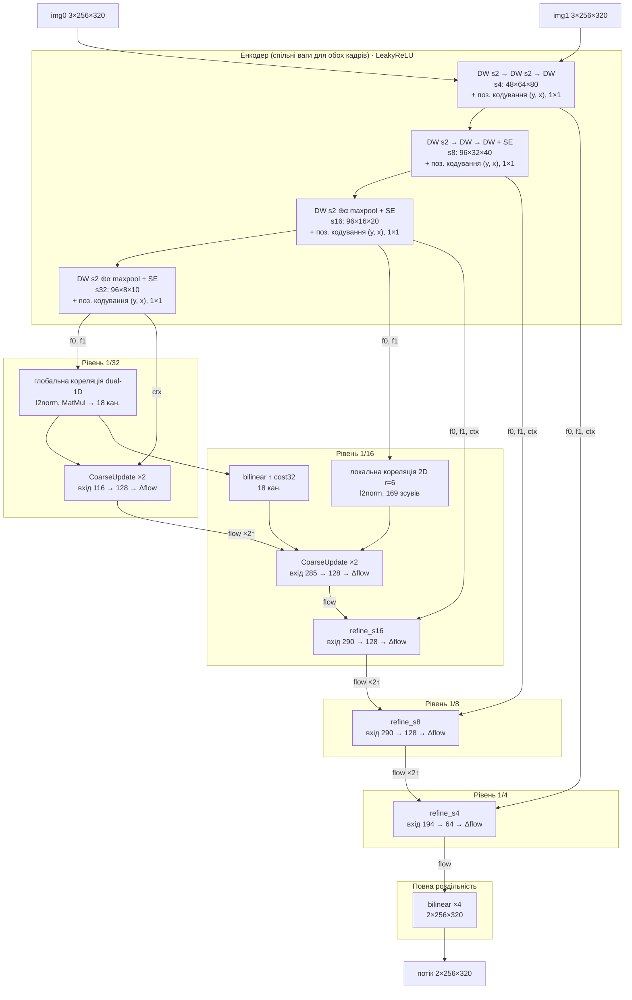
```mermaid
flowchart TB
    I0["img0 3×256×320"]
    I1["img1 3×256×320"]
  subgraph G_enc["Енкодер (спільні ваги для обох кадрів) · LeakyReLU"]
    direction TB
    E4["DW s2 → DW s2 → DW<br/>s4: 48×64×80<br/>+ поз. кодування (y, x), 1×1"]
    E8["DW s2 → DW → DW + SE<br/>s8: 96×32×40<br/>+ поз. кодування (y, x), 1×1"]
    E16["DW s2 ⊕α maxpool + SE<br/>s16: 96×16×20<br/>+ поз. кодування (y, x), 1×1"]
    E32["DW s2 ⊕α maxpool + SE<br/>s32: 96×8×10<br/>+ поз. кодування (y, x), 1×1"]
  end
  subgraph G_s32["Рівень 1/32"]
    direction TB
    C32["глобальна кореляція dual-1D<br/>l2norm, MatMul → 18 кан."]
    U32["CoarseUpdate ×2<br/>вхід 116 → 128 → Δflow"]
  end
  subgraph G_s16["Рівень 1/16"]
    direction TB
    C16["локальна кореляція 2D r=6<br/>l2norm, 169 зсувів"]
    UP32["bilinear ↑ cost32<br/>18 кан."]
    U16["CoarseUpdate ×2<br/>вхід 285 → 128 → Δflow"]
    R16["refine_s16<br/>вхід 290 → 128 → Δflow"]
  end
  subgraph G_s8["Рівень 1/8"]
    direction TB
    R8["refine_s8<br/>вхід 290 → 128 → Δflow"]
  end
  subgraph G_s4["Рівень 1/4"]
    direction TB
    R4["refine_s4<br/>вхід 194 → 64 → Δflow"]
  end
  subgraph G_full["Повна роздільність"]
    direction TB
    UPF["bilinear ×4<br/>2×256×320"]
  end
    OUT["потік 2×256×320"]
  I0 --> E4
  I1 --> E4
  E4 --> E8
  E8 --> E16
  E16 --> E32
  E32 -->|f0, f1| C32
  C32 --> U32
  E32 -->|ctx| U32
  E16 -->|f0, f1| C16
  C16 --> U16
  U16 -->|flow| R16
  E16 -->|f0, f1, ctx| R16
  C32 --> UP32
  UP32 --> U16
  U32 -->|flow ×2↑| U16
  R16 -->|flow ×2↑| R8
  E8 -->|f0, f1, ctx| R8
  R8 -->|flow ×2↑| R4
  E4 -->|f0, f1, ctx| R4
  R4 -->|flow| UPF
  UPF --> OUT
  classDef changed fill:#ffe0b2,stroke:#e65100,stroke-width:2px,color:#000
```

Прибрано відносно B0: full_refine на 256×320, DW + dilated DW + 1×1, вхід flow + img0.

## S3_pixelshuffle

Зміни відносно B0: `full_refine: pixelshuffle`. Параметрів: 0.506 M. Час на MaixCAM: INT8 25.26 мс, mixed 25.72 мс.

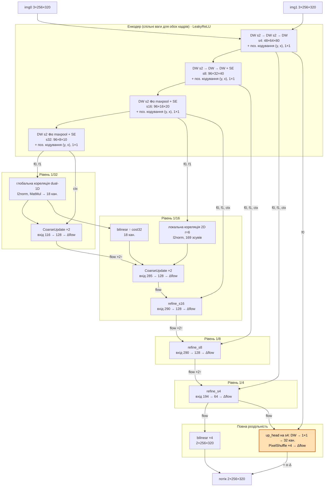
```mermaid
flowchart TB
    I0["img0 3×256×320"]
    I1["img1 3×256×320"]
  subgraph G_enc["Енкодер (спільні ваги для обох кадрів) · LeakyReLU"]
    direction TB
    E4["DW s2 → DW s2 → DW<br/>s4: 48×64×80<br/>+ поз. кодування (y, x), 1×1"]
    E8["DW s2 → DW → DW + SE<br/>s8: 96×32×40<br/>+ поз. кодування (y, x), 1×1"]
    E16["DW s2 ⊕α maxpool + SE<br/>s16: 96×16×20<br/>+ поз. кодування (y, x), 1×1"]
    E32["DW s2 ⊕α maxpool + SE<br/>s32: 96×8×10<br/>+ поз. кодування (y, x), 1×1"]
  end
  subgraph G_s32["Рівень 1/32"]
    direction TB
    C32["глобальна кореляція dual-1D<br/>l2norm, MatMul → 18 кан."]
    U32["CoarseUpdate ×2<br/>вхід 116 → 128 → Δflow"]
  end
  subgraph G_s16["Рівень 1/16"]
    direction TB
    C16["локальна кореляція 2D r=6<br/>l2norm, 169 зсувів"]
    UP32["bilinear ↑ cost32<br/>18 кан."]
    U16["CoarseUpdate ×2<br/>вхід 285 → 128 → Δflow"]
    R16["refine_s16<br/>вхід 290 → 128 → Δflow"]
  end
  subgraph G_s8["Рівень 1/8"]
    direction TB
    R8["refine_s8<br/>вхід 290 → 128 → Δflow"]
  end
  subgraph G_s4["Рівень 1/4"]
    direction TB
    R4["refine_s4<br/>вхід 194 → 64 → Δflow"]
  end
  subgraph G_full["Повна роздільність"]
    direction TB
    UPF["bilinear ×4<br/>2×256×320"]
    FR["up_head на s4: DW → 1×1 → 32 кан.<br/>PixelShuffle ×4 → Δflow"]
  end
    OUT["потік 2×256×320"]
  I0 --> E4
  I1 --> E4
  E4 --> E8
  E8 --> E16
  E16 --> E32
  E32 -->|f0, f1| C32
  C32 --> U32
  E32 -->|ctx| U32
  E16 -->|f0, f1| C16
  C16 --> U16
  U16 -->|flow| R16
  E16 -->|f0, f1, ctx| R16
  C32 --> UP32
  UP32 --> U16
  U32 -->|flow ×2↑| U16
  R16 -->|flow ×2↑| R8
  E8 -->|f0, f1, ctx| R8
  R8 -->|flow ×2↑| R4
  E4 -->|f0, f1, ctx| R4
  R4 -->|flow| UPF
  R4 -->|flow| FR
  E4 -->|f0| FR
  UPF --> OUT
  FR -->|+ α·Δ| OUT
  classDef changed fill:#ffe0b2,stroke:#e65100,stroke-width:2px,color:#000
  class FR changed
```

## S4_relu

Зміни відносно B0: `act: relu`. Параметрів: 0.502 M. Час на MaixCAM: INT8 27.75 мс, mixed 36.44 мс.

Активація ReLU в усіх блоках (у B0 — LeakyReLU); вузли через це не підсвічено.

```mermaid
flowchart TB
    I0["img0 3×256×320"]
    I1["img1 3×256×320"]
  subgraph G_enc["Енкодер (спільні ваги для обох кадрів) · ReLU"]
    direction TB
    E4["DW s2 → DW s2 → DW<br/>s4: 48×64×80<br/>+ поз. кодування (y, x), 1×1"]
    E8["DW s2 → DW → DW + SE<br/>s8: 96×32×40<br/>+ поз. кодування (y, x), 1×1"]
    E16["DW s2 ⊕α maxpool + SE<br/>s16: 96×16×20<br/>+ поз. кодування (y, x), 1×1"]
    E32["DW s2 ⊕α maxpool + SE<br/>s32: 96×8×10<br/>+ поз. кодування (y, x), 1×1"]
  end
  subgraph G_s32["Рівень 1/32"]
    direction TB
    C32["глобальна кореляція dual-1D<br/>l2norm, MatMul → 18 кан."]
    U32["CoarseUpdate ×2<br/>вхід 116 → 128 → Δflow"]
  end
  subgraph G_s16["Рівень 1/16"]
    direction TB
    C16["локальна кореляція 2D r=6<br/>l2norm, 169 зсувів"]
    UP32["bilinear ↑ cost32<br/>18 кан."]
    U16["CoarseUpdate ×2<br/>вхід 285 → 128 → Δflow"]
    R16["refine_s16<br/>вхід 290 → 128 → Δflow"]
  end
  subgraph G_s8["Рівень 1/8"]
    direction TB
    R8["refine_s8<br/>вхід 290 → 128 → Δflow"]
  end
  subgraph G_s4["Рівень 1/4"]
    direction TB
    R4["refine_s4<br/>вхід 194 → 64 → Δflow"]
  end
  subgraph G_full["Повна роздільність"]
    direction TB
    UPF["bilinear ×4<br/>2×256×320"]
    FR["full_refine на 256×320<br/>DW + dilated DW + 1×1, вхід flow + img0"]
  end
    OUT["потік 2×256×320"]
  I0 --> E4
  I1 --> E4
  E4 --> E8
  E8 --> E16
  E16 --> E32
  E32 -->|f0, f1| C32
  C32 --> U32
  E32 -->|ctx| U32
  E16 -->|f0, f1| C16
  C16 --> U16
  U16 -->|flow| R16
  E16 -->|f0, f1, ctx| R16
  C32 --> UP32
  UP32 --> U16
  U32 -->|flow ×2↑| U16
  R16 -->|flow ×2↑| R8
  E8 -->|f0, f1, ctx| R8
  R8 -->|flow ×2↑| R4
  E4 -->|f0, f1, ctx| R4
  R4 -->|flow| UPF
  UPF --> FR
  I0 -->|img0| FR
  FR --> OUT
  classDef changed fill:#ffe0b2,stroke:#e65100,stroke-width:2px,color:#000
```

## S5_no_se

Зміни відносно B0: `use_se: False`. Параметрів: 0.498 M. Час на MaixCAM: INT8 28.57 мс, mixed 39.66 мс.

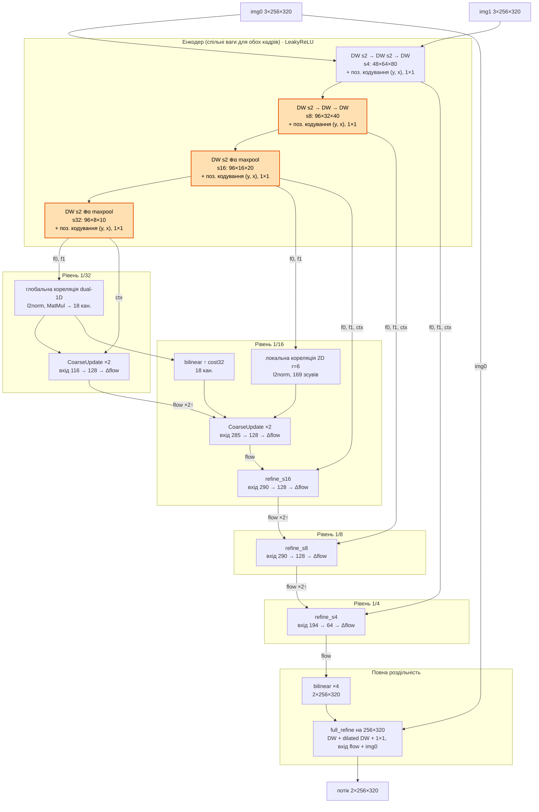
```mermaid
flowchart TB
    I0["img0 3×256×320"]
    I1["img1 3×256×320"]
  subgraph G_enc["Енкодер (спільні ваги для обох кадрів) · LeakyReLU"]
    direction TB
    E4["DW s2 → DW s2 → DW<br/>s4: 48×64×80<br/>+ поз. кодування (y, x), 1×1"]
    E8["DW s2 → DW → DW<br/>s8: 96×32×40<br/>+ поз. кодування (y, x), 1×1"]
    E16["DW s2 ⊕α maxpool<br/>s16: 96×16×20<br/>+ поз. кодування (y, x), 1×1"]
    E32["DW s2 ⊕α maxpool<br/>s32: 96×8×10<br/>+ поз. кодування (y, x), 1×1"]
  end
  subgraph G_s32["Рівень 1/32"]
    direction TB
    C32["глобальна кореляція dual-1D<br/>l2norm, MatMul → 18 кан."]
    U32["CoarseUpdate ×2<br/>вхід 116 → 128 → Δflow"]
  end
  subgraph G_s16["Рівень 1/16"]
    direction TB
    C16["локальна кореляція 2D r=6<br/>l2norm, 169 зсувів"]
    UP32["bilinear ↑ cost32<br/>18 кан."]
    U16["CoarseUpdate ×2<br/>вхід 285 → 128 → Δflow"]
    R16["refine_s16<br/>вхід 290 → 128 → Δflow"]
  end
  subgraph G_s8["Рівень 1/8"]
    direction TB
    R8["refine_s8<br/>вхід 290 → 128 → Δflow"]
  end
  subgraph G_s4["Рівень 1/4"]
    direction TB
    R4["refine_s4<br/>вхід 194 → 64 → Δflow"]
  end
  subgraph G_full["Повна роздільність"]
    direction TB
    UPF["bilinear ×4<br/>2×256×320"]
    FR["full_refine на 256×320<br/>DW + dilated DW + 1×1, вхід flow + img0"]
  end
    OUT["потік 2×256×320"]
  I0 --> E4
  I1 --> E4
  E4 --> E8
  E8 --> E16
  E16 --> E32
  E32 -->|f0, f1| C32
  C32 --> U32
  E32 -->|ctx| U32
  E16 -->|f0, f1| C16
  C16 --> U16
  U16 -->|flow| R16
  E16 -->|f0, f1, ctx| R16
  C32 --> UP32
  UP32 --> U16
  U32 -->|flow ×2↑| U16
  R16 -->|flow ×2↑| R8
  E8 -->|f0, f1, ctx| R8
  R8 -->|flow ×2↑| R4
  E4 -->|f0, f1, ctx| R4
  R4 -->|flow| UPF
  UPF --> FR
  I0 -->|img0| FR
  FR --> OUT
  classDef changed fill:#ffe0b2,stroke:#e65100,stroke-width:2px,color:#000
  class E8,E16,E32 changed
```

## S6_no_pos_enc

Зміни відносно B0: `use_pos_enc: False`. Параметрів: 0.471 M. Час на MaixCAM: INT8 26.06 мс, mixed 36.66 мс.

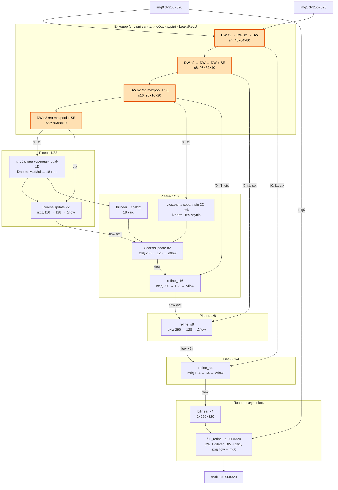
```mermaid
flowchart TB
    I0["img0 3×256×320"]
    I1["img1 3×256×320"]
  subgraph G_enc["Енкодер (спільні ваги для обох кадрів) · LeakyReLU"]
    direction TB
    E4["DW s2 → DW s2 → DW<br/>s4: 48×64×80"]
    E8["DW s2 → DW → DW + SE<br/>s8: 96×32×40"]
    E16["DW s2 ⊕α maxpool + SE<br/>s16: 96×16×20"]
    E32["DW s2 ⊕α maxpool + SE<br/>s32: 96×8×10"]
  end
  subgraph G_s32["Рівень 1/32"]
    direction TB
    C32["глобальна кореляція dual-1D<br/>l2norm, MatMul → 18 кан."]
    U32["CoarseUpdate ×2<br/>вхід 116 → 128 → Δflow"]
  end
  subgraph G_s16["Рівень 1/16"]
    direction TB
    C16["локальна кореляція 2D r=6<br/>l2norm, 169 зсувів"]
    UP32["bilinear ↑ cost32<br/>18 кан."]
    U16["CoarseUpdate ×2<br/>вхід 285 → 128 → Δflow"]
    R16["refine_s16<br/>вхід 290 → 128 → Δflow"]
  end
  subgraph G_s8["Рівень 1/8"]
    direction TB
    R8["refine_s8<br/>вхід 290 → 128 → Δflow"]
  end
  subgraph G_s4["Рівень 1/4"]
    direction TB
    R4["refine_s4<br/>вхід 194 → 64 → Δflow"]
  end
  subgraph G_full["Повна роздільність"]
    direction TB
    UPF["bilinear ×4<br/>2×256×320"]
    FR["full_refine на 256×320<br/>DW + dilated DW + 1×1, вхід flow + img0"]
  end
    OUT["потік 2×256×320"]
  I0 --> E4
  I1 --> E4
  E4 --> E8
  E8 --> E16
  E16 --> E32
  E32 -->|f0, f1| C32
  C32 --> U32
  E32 -->|ctx| U32
  E16 -->|f0, f1| C16
  C16 --> U16
  U16 -->|flow| R16
  E16 -->|f0, f1, ctx| R16
  C32 --> UP32
  UP32 --> U16
  U32 -->|flow ×2↑| U16
  R16 -->|flow ×2↑| R8
  E8 -->|f0, f1, ctx| R8
  R8 -->|flow ×2↑| R4
  E4 -->|f0, f1, ctx| R4
  R4 -->|flow| UPF
  UPF --> FR
  I0 -->|img0| FR
  FR --> OUT
  classDef changed fill:#ffe0b2,stroke:#e65100,stroke-width:2px,color:#000
  class E4,E8,E16,E32 changed
```

## S7_no_l2norm

Зміни відносно B0: `use_l2norm: False`. Параметрів: 0.502 M. Час на MaixCAM: INT8 28.84 мс, mixed 39.89 мс.

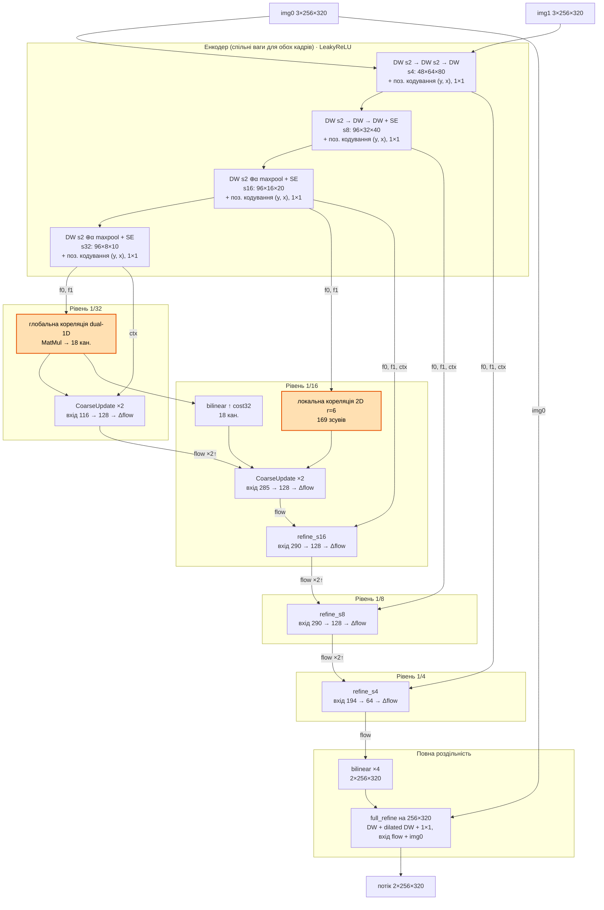
```mermaid
flowchart TB
    I0["img0 3×256×320"]
    I1["img1 3×256×320"]
  subgraph G_enc["Енкодер (спільні ваги для обох кадрів) · LeakyReLU"]
    direction TB
    E4["DW s2 → DW s2 → DW<br/>s4: 48×64×80<br/>+ поз. кодування (y, x), 1×1"]
    E8["DW s2 → DW → DW + SE<br/>s8: 96×32×40<br/>+ поз. кодування (y, x), 1×1"]
    E16["DW s2 ⊕α maxpool + SE<br/>s16: 96×16×20<br/>+ поз. кодування (y, x), 1×1"]
    E32["DW s2 ⊕α maxpool + SE<br/>s32: 96×8×10<br/>+ поз. кодування (y, x), 1×1"]
  end
  subgraph G_s32["Рівень 1/32"]
    direction TB
    C32["глобальна кореляція dual-1D<br/>MatMul → 18 кан."]
    U32["CoarseUpdate ×2<br/>вхід 116 → 128 → Δflow"]
  end
  subgraph G_s16["Рівень 1/16"]
    direction TB
    C16["локальна кореляція 2D r=6<br/>169 зсувів"]
    UP32["bilinear ↑ cost32<br/>18 кан."]
    U16["CoarseUpdate ×2<br/>вхід 285 → 128 → Δflow"]
    R16["refine_s16<br/>вхід 290 → 128 → Δflow"]
  end
  subgraph G_s8["Рівень 1/8"]
    direction TB
    R8["refine_s8<br/>вхід 290 → 128 → Δflow"]
  end
  subgraph G_s4["Рівень 1/4"]
    direction TB
    R4["refine_s4<br/>вхід 194 → 64 → Δflow"]
  end
  subgraph G_full["Повна роздільність"]
    direction TB
    UPF["bilinear ×4<br/>2×256×320"]
    FR["full_refine на 256×320<br/>DW + dilated DW + 1×1, вхід flow + img0"]
  end
    OUT["потік 2×256×320"]
  I0 --> E4
  I1 --> E4
  E4 --> E8
  E8 --> E16
  E16 --> E32
  E32 -->|f0, f1| C32
  C32 --> U32
  E32 -->|ctx| U32
  E16 -->|f0, f1| C16
  C16 --> U16
  U16 -->|flow| R16
  E16 -->|f0, f1, ctx| R16
  C32 --> UP32
  UP32 --> U16
  U32 -->|flow ×2↑| U16
  R16 -->|flow ×2↑| R8
  E8 -->|f0, f1, ctx| R8
  R8 -->|flow ×2↑| R4
  E4 -->|f0, f1, ctx| R4
  R4 -->|flow| UPF
  UPF --> FR
  I0 -->|img0| FR
  FR --> OUT
  classDef changed fill:#ffe0b2,stroke:#e65100,stroke-width:2px,color:#000
  class C32,C16 changed
```

## S8_iters1

Зміни відносно B0: `iters32: 1`, `iters16: 1`. Параметрів: 0.502 M. Час на MaixCAM: INT8 28.65 мс, mixed 39.70 мс.

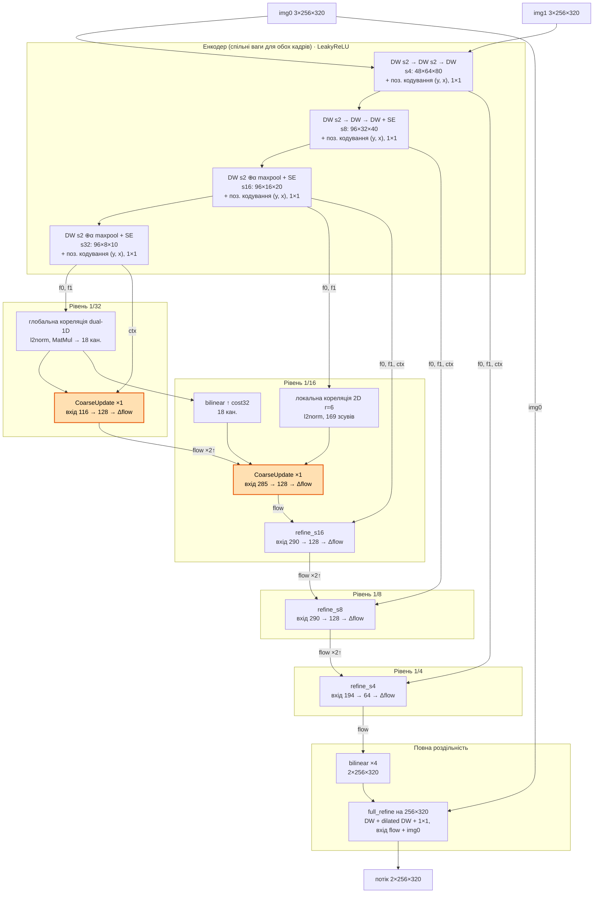
```mermaid
flowchart TB
    I0["img0 3×256×320"]
    I1["img1 3×256×320"]
  subgraph G_enc["Енкодер (спільні ваги для обох кадрів) · LeakyReLU"]
    direction TB
    E4["DW s2 → DW s2 → DW<br/>s4: 48×64×80<br/>+ поз. кодування (y, x), 1×1"]
    E8["DW s2 → DW → DW + SE<br/>s8: 96×32×40<br/>+ поз. кодування (y, x), 1×1"]
    E16["DW s2 ⊕α maxpool + SE<br/>s16: 96×16×20<br/>+ поз. кодування (y, x), 1×1"]
    E32["DW s2 ⊕α maxpool + SE<br/>s32: 96×8×10<br/>+ поз. кодування (y, x), 1×1"]
  end
  subgraph G_s32["Рівень 1/32"]
    direction TB
    C32["глобальна кореляція dual-1D<br/>l2norm, MatMul → 18 кан."]
    U32["CoarseUpdate ×1<br/>вхід 116 → 128 → Δflow"]
  end
  subgraph G_s16["Рівень 1/16"]
    direction TB
    C16["локальна кореляція 2D r=6<br/>l2norm, 169 зсувів"]
    UP32["bilinear ↑ cost32<br/>18 кан."]
    U16["CoarseUpdate ×1<br/>вхід 285 → 128 → Δflow"]
    R16["refine_s16<br/>вхід 290 → 128 → Δflow"]
  end
  subgraph G_s8["Рівень 1/8"]
    direction TB
    R8["refine_s8<br/>вхід 290 → 128 → Δflow"]
  end
  subgraph G_s4["Рівень 1/4"]
    direction TB
    R4["refine_s4<br/>вхід 194 → 64 → Δflow"]
  end
  subgraph G_full["Повна роздільність"]
    direction TB
    UPF["bilinear ×4<br/>2×256×320"]
    FR["full_refine на 256×320<br/>DW + dilated DW + 1×1, вхід flow + img0"]
  end
    OUT["потік 2×256×320"]
  I0 --> E4
  I1 --> E4
  E4 --> E8
  E8 --> E16
  E16 --> E32
  E32 -->|f0, f1| C32
  C32 --> U32
  E32 -->|ctx| U32
  E16 -->|f0, f1| C16
  C16 --> U16
  U16 -->|flow| R16
  E16 -->|f0, f1, ctx| R16
  C32 --> UP32
  UP32 --> U16
  U32 -->|flow ×2↑| U16
  R16 -->|flow ×2↑| R8
  E8 -->|f0, f1, ctx| R8
  R8 -->|flow ×2↑| R4
  E4 -->|f0, f1, ctx| R4
  R4 -->|flow| UPF
  UPF --> FR
  I0 -->|img0| FR
  FR --> OUT
  classDef changed fill:#ffe0b2,stroke:#e65100,stroke-width:2px,color:#000
  class U32,U16 changed
```

## S9a_corr16_r4

Зміни відносно B0: `r16: 4`. Параметрів: 0.490 M. Час на MaixCAM: INT8 22.98 мс, mixed 34.07 мс.

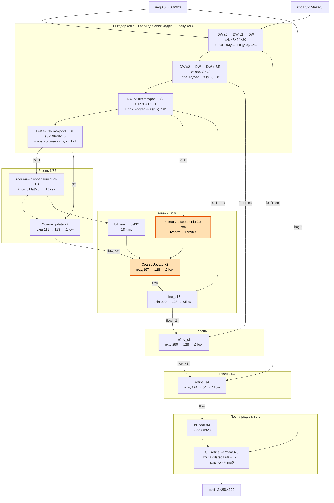
```mermaid
flowchart TB
    I0["img0 3×256×320"]
    I1["img1 3×256×320"]
  subgraph G_enc["Енкодер (спільні ваги для обох кадрів) · LeakyReLU"]
    direction TB
    E4["DW s2 → DW s2 → DW<br/>s4: 48×64×80<br/>+ поз. кодування (y, x), 1×1"]
    E8["DW s2 → DW → DW + SE<br/>s8: 96×32×40<br/>+ поз. кодування (y, x), 1×1"]
    E16["DW s2 ⊕α maxpool + SE<br/>s16: 96×16×20<br/>+ поз. кодування (y, x), 1×1"]
    E32["DW s2 ⊕α maxpool + SE<br/>s32: 96×8×10<br/>+ поз. кодування (y, x), 1×1"]
  end
  subgraph G_s32["Рівень 1/32"]
    direction TB
    C32["глобальна кореляція dual-1D<br/>l2norm, MatMul → 18 кан."]
    U32["CoarseUpdate ×2<br/>вхід 116 → 128 → Δflow"]
  end
  subgraph G_s16["Рівень 1/16"]
    direction TB
    C16["локальна кореляція 2D r=4<br/>l2norm, 81 зсувів"]
    UP32["bilinear ↑ cost32<br/>18 кан."]
    U16["CoarseUpdate ×2<br/>вхід 197 → 128 → Δflow"]
    R16["refine_s16<br/>вхід 290 → 128 → Δflow"]
  end
  subgraph G_s8["Рівень 1/8"]
    direction TB
    R8["refine_s8<br/>вхід 290 → 128 → Δflow"]
  end
  subgraph G_s4["Рівень 1/4"]
    direction TB
    R4["refine_s4<br/>вхід 194 → 64 → Δflow"]
  end
  subgraph G_full["Повна роздільність"]
    direction TB
    UPF["bilinear ×4<br/>2×256×320"]
    FR["full_refine на 256×320<br/>DW + dilated DW + 1×1, вхід flow + img0"]
  end
    OUT["потік 2×256×320"]
  I0 --> E4
  I1 --> E4
  E4 --> E8
  E8 --> E16
  E16 --> E32
  E32 -->|f0, f1| C32
  C32 --> U32
  E32 -->|ctx| U32
  E16 -->|f0, f1| C16
  C16 --> U16
  U16 -->|flow| R16
  E16 -->|f0, f1, ctx| R16
  C32 --> UP32
  UP32 --> U16
  U32 -->|flow ×2↑| U16
  R16 -->|flow ×2↑| R8
  E8 -->|f0, f1, ctx| R8
  R8 -->|flow ×2↑| R4
  E4 -->|f0, f1, ctx| R4
  R4 -->|flow| UPF
  UPF --> FR
  I0 -->|img0| FR
  FR --> OUT
  classDef changed fill:#ffe0b2,stroke:#e65100,stroke-width:2px,color:#000
  class C16,U16 changed
```

## S9b_corr16_1d

Зміни відносно B0: `corr16: 1d`. Параметрів: 0.483 M. Час на MaixCAM: INT8 19.40 мс, mixed 30.47 мс.

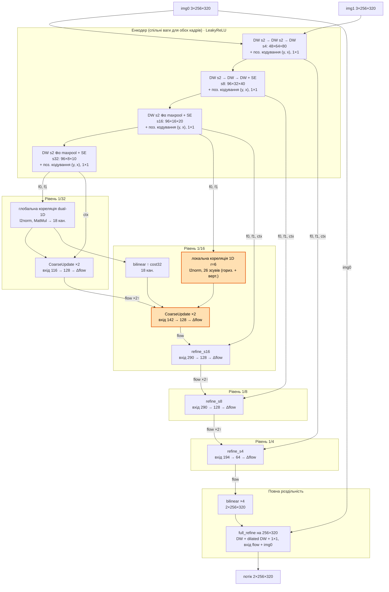
```mermaid
flowchart TB
    I0["img0 3×256×320"]
    I1["img1 3×256×320"]
  subgraph G_enc["Енкодер (спільні ваги для обох кадрів) · LeakyReLU"]
    direction TB
    E4["DW s2 → DW s2 → DW<br/>s4: 48×64×80<br/>+ поз. кодування (y, x), 1×1"]
    E8["DW s2 → DW → DW + SE<br/>s8: 96×32×40<br/>+ поз. кодування (y, x), 1×1"]
    E16["DW s2 ⊕α maxpool + SE<br/>s16: 96×16×20<br/>+ поз. кодування (y, x), 1×1"]
    E32["DW s2 ⊕α maxpool + SE<br/>s32: 96×8×10<br/>+ поз. кодування (y, x), 1×1"]
  end
  subgraph G_s32["Рівень 1/32"]
    direction TB
    C32["глобальна кореляція dual-1D<br/>l2norm, MatMul → 18 кан."]
    U32["CoarseUpdate ×2<br/>вхід 116 → 128 → Δflow"]
  end
  subgraph G_s16["Рівень 1/16"]
    direction TB
    C16["локальна кореляція 1D r=6<br/>l2norm, 26 зсувів (гориз. + верт.)"]
    UP32["bilinear ↑ cost32<br/>18 кан."]
    U16["CoarseUpdate ×2<br/>вхід 142 → 128 → Δflow"]
    R16["refine_s16<br/>вхід 290 → 128 → Δflow"]
  end
  subgraph G_s8["Рівень 1/8"]
    direction TB
    R8["refine_s8<br/>вхід 290 → 128 → Δflow"]
  end
  subgraph G_s4["Рівень 1/4"]
    direction TB
    R4["refine_s4<br/>вхід 194 → 64 → Δflow"]
  end
  subgraph G_full["Повна роздільність"]
    direction TB
    UPF["bilinear ×4<br/>2×256×320"]
    FR["full_refine на 256×320<br/>DW + dilated DW + 1×1, вхід flow + img0"]
  end
    OUT["потік 2×256×320"]
  I0 --> E4
  I1 --> E4
  E4 --> E8
  E8 --> E16
  E16 --> E32
  E32 -->|f0, f1| C32
  C32 --> U32
  E32 -->|ctx| U32
  E16 -->|f0, f1| C16
  C16 --> U16
  U16 -->|flow| R16
  E16 -->|f0, f1, ctx| R16
  C32 --> UP32
  UP32 --> U16
  U32 -->|flow ×2↑| U16
  R16 -->|flow ×2↑| R8
  E8 -->|f0, f1, ctx| R8
  R8 -->|flow ×2↑| R4
  E4 -->|f0, f1, ctx| R4
  R4 -->|flow| UPF
  UPF --> FR
  I0 -->|img0| FR
  FR --> OUT
  classDef changed fill:#ffe0b2,stroke:#e65100,stroke-width:2px,color:#000
  class C16,U16 changed
```

## C1_1d_ps

Зміни відносно B0: `corr16: 1d`, `full_refine: pixelshuffle`. Параметрів: 0.487 M. Час на MaixCAM: INT8 15.70 мс, mixed 16.16 мс.

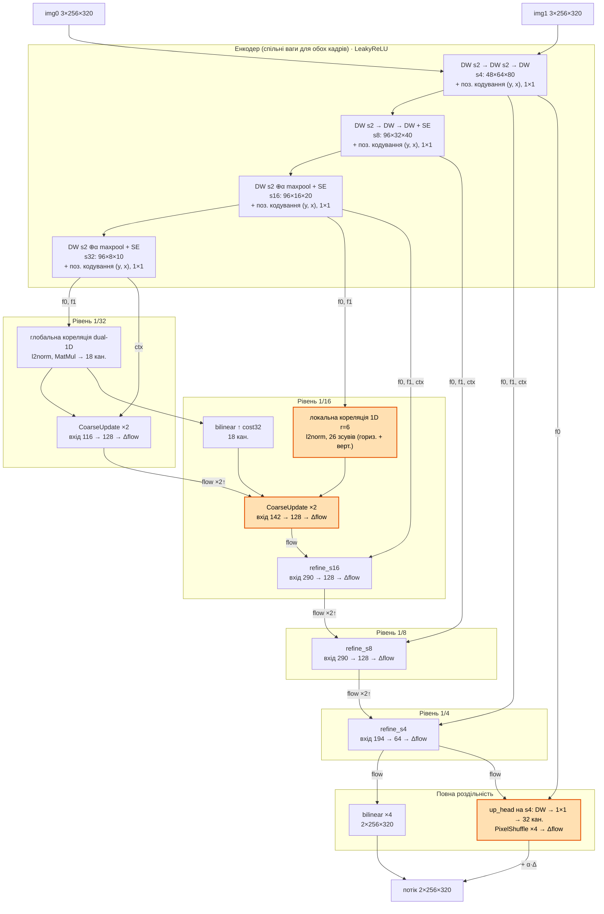
```mermaid
flowchart TB
    I0["img0 3×256×320"]
    I1["img1 3×256×320"]
  subgraph G_enc["Енкодер (спільні ваги для обох кадрів) · LeakyReLU"]
    direction TB
    E4["DW s2 → DW s2 → DW<br/>s4: 48×64×80<br/>+ поз. кодування (y, x), 1×1"]
    E8["DW s2 → DW → DW + SE<br/>s8: 96×32×40<br/>+ поз. кодування (y, x), 1×1"]
    E16["DW s2 ⊕α maxpool + SE<br/>s16: 96×16×20<br/>+ поз. кодування (y, x), 1×1"]
    E32["DW s2 ⊕α maxpool + SE<br/>s32: 96×8×10<br/>+ поз. кодування (y, x), 1×1"]
  end
  subgraph G_s32["Рівень 1/32"]
    direction TB
    C32["глобальна кореляція dual-1D<br/>l2norm, MatMul → 18 кан."]
    U32["CoarseUpdate ×2<br/>вхід 116 → 128 → Δflow"]
  end
  subgraph G_s16["Рівень 1/16"]
    direction TB
    C16["локальна кореляція 1D r=6<br/>l2norm, 26 зсувів (гориз. + верт.)"]
    UP32["bilinear ↑ cost32<br/>18 кан."]
    U16["CoarseUpdate ×2<br/>вхід 142 → 128 → Δflow"]
    R16["refine_s16<br/>вхід 290 → 128 → Δflow"]
  end
  subgraph G_s8["Рівень 1/8"]
    direction TB
    R8["refine_s8<br/>вхід 290 → 128 → Δflow"]
  end
  subgraph G_s4["Рівень 1/4"]
    direction TB
    R4["refine_s4<br/>вхід 194 → 64 → Δflow"]
  end
  subgraph G_full["Повна роздільність"]
    direction TB
    UPF["bilinear ×4<br/>2×256×320"]
    FR["up_head на s4: DW → 1×1 → 32 кан.<br/>PixelShuffle ×4 → Δflow"]
  end
    OUT["потік 2×256×320"]
  I0 --> E4
  I1 --> E4
  E4 --> E8
  E8 --> E16
  E16 --> E32
  E32 -->|f0, f1| C32
  C32 --> U32
  E32 -->|ctx| U32
  E16 -->|f0, f1| C16
  C16 --> U16
  U16 -->|flow| R16
  E16 -->|f0, f1, ctx| R16
  C32 --> UP32
  UP32 --> U16
  U32 -->|flow ×2↑| U16
  R16 -->|flow ×2↑| R8
  E8 -->|f0, f1, ctx| R8
  R8 -->|flow ×2↑| R4
  E4 -->|f0, f1, ctx| R4
  R4 -->|flow| UPF
  R4 -->|flow| FR
  E4 -->|f0| FR
  UPF --> OUT
  FR -->|+ α·Δ| OUT
  classDef changed fill:#ffe0b2,stroke:#e65100,stroke-width:2px,color:#000
  class C16,U16,FR changed
```

## C2_1d_ps_nopos

Зміни відносно B0: `corr16: 1d`, `full_refine: pixelshuffle`, `use_pos_enc: False`. Параметрів: 0.457 M. Час на MaixCAM: INT8 12.45 мс, mixed 12.91 мс.

```mermaid
flowchart TB
    I0["img0 3×256×320"]
    I1["img1 3×256×320"]
  subgraph G_enc["Енкодер (спільні ваги для обох кадрів) · LeakyReLU"]
    direction TB
    E4["DW s2 → DW s2 → DW<br/>s4: 48×64×80"]
    E8["DW s2 → DW → DW + SE<br/>s8: 96×32×40"]
    E16["DW s2 ⊕α maxpool + SE<br/>s16: 96×16×20"]
    E32["DW s2 ⊕α maxpool + SE<br/>s32: 96×8×10"]
  end
  subgraph G_s32["Рівень 1/32"]
    direction TB
    C32["глобальна кореляція dual-1D<br/>l2norm, MatMul → 18 кан."]
    U32["CoarseUpdate ×2<br/>вхід 116 → 128 → Δflow"]
  end
  subgraph G_s16["Рівень 1/16"]
    direction TB
    C16["локальна кореляція 1D r=6<br/>l2norm, 26 зсувів (гориз. + верт.)"]
    UP32["bilinear ↑ cost32<br/>18 кан."]
    U16["CoarseUpdate ×2<br/>вхід 142 → 128 → Δflow"]
    R16["refine_s16<br/>вхід 290 → 128 → Δflow"]
  end
  subgraph G_s8["Рівень 1/8"]
    direction TB
    R8["refine_s8<br/>вхід 290 → 128 → Δflow"]
  end
  subgraph G_s4["Рівень 1/4"]
    direction TB
    R4["refine_s4<br/>вхід 194 → 64 → Δflow"]
  end
  subgraph G_full["Повна роздільність"]
    direction TB
    UPF["bilinear ×4<br/>2×256×320"]
    FR["up_head на s4: DW → 1×1 → 32 кан.<br/>PixelShuffle ×4 → Δflow"]
  end
    OUT["потік 2×256×320"]
  I0 --> E4
  I1 --> E4
  E4 --> E8
  E8 --> E16
  E16 --> E32
  E32 -->|f0, f1| C32
  C32 --> U32
  E32 -->|ctx| U32
  E16 -->|f0, f1| C16
  C16 --> U16
  U16 -->|flow| R16
  E16 -->|f0, f1, ctx| R16
  C32 --> UP32
  UP32 --> U16
  U32 -->|flow ×2↑| U16
  R16 -->|flow ×2↑| R8
  E8 -->|f0, f1, ctx| R8
  R8 -->|flow ×2↑| R4
  E4 -->|f0, f1, ctx| R4
  R4 -->|flow| UPF
  R4 -->|flow| FR
  E4 -->|f0| FR
  UPF --> OUT
  FR -->|+ α·Δ| OUT
  classDef changed fill:#ffe0b2,stroke:#e65100,stroke-width:2px,color:#000
  class E4,E8,E16,E32,C16,U16,FR changed
```

## C3_1d_ps_nopos_relu

Зміни відносно B0: `corr16: 1d`, `full_refine: pixelshuffle`, `use_pos_enc: False`, `act: relu`. Параметрів: 0.457 M. Час на MaixCAM: INT8 11.25 мс, mixed 11.71 мс.

Активація ReLU в усіх блоках (у B0 — LeakyReLU); вузли через це не підсвічено.

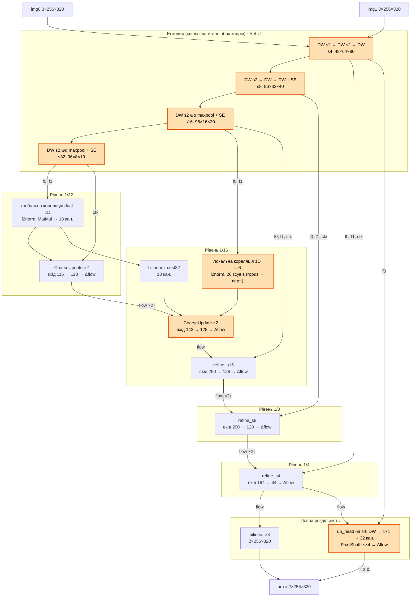
```mermaid
flowchart TB
    I0["img0 3×256×320"]
    I1["img1 3×256×320"]
  subgraph G_enc["Енкодер (спільні ваги для обох кадрів) · ReLU"]
    direction TB
    E4["DW s2 → DW s2 → DW<br/>s4: 48×64×80"]
    E8["DW s2 → DW → DW + SE<br/>s8: 96×32×40"]
    E16["DW s2 ⊕α maxpool + SE<br/>s16: 96×16×20"]
    E32["DW s2 ⊕α maxpool + SE<br/>s32: 96×8×10"]
  end
  subgraph G_s32["Рівень 1/32"]
    direction TB
    C32["глобальна кореляція dual-1D<br/>l2norm, MatMul → 18 кан."]
    U32["CoarseUpdate ×2<br/>вхід 116 → 128 → Δflow"]
  end
  subgraph G_s16["Рівень 1/16"]
    direction TB
    C16["локальна кореляція 1D r=6<br/>l2norm, 26 зсувів (гориз. + верт.)"]
    UP32["bilinear ↑ cost32<br/>18 кан."]
    U16["CoarseUpdate ×2<br/>вхід 142 → 128 → Δflow"]
    R16["refine_s16<br/>вхід 290 → 128 → Δflow"]
  end
  subgraph G_s8["Рівень 1/8"]
    direction TB
    R8["refine_s8<br/>вхід 290 → 128 → Δflow"]
  end
  subgraph G_s4["Рівень 1/4"]
    direction TB
    R4["refine_s4<br/>вхід 194 → 64 → Δflow"]
  end
  subgraph G_full["Повна роздільність"]
    direction TB
    UPF["bilinear ×4<br/>2×256×320"]
    FR["up_head на s4: DW → 1×1 → 32 кан.<br/>PixelShuffle ×4 → Δflow"]
  end
    OUT["потік 2×256×320"]
  I0 --> E4
  I1 --> E4
  E4 --> E8
  E8 --> E16
  E16 --> E32
  E32 -->|f0, f1| C32
  C32 --> U32
  E32 -->|ctx| U32
  E16 -->|f0, f1| C16
  C16 --> U16
  U16 -->|flow| R16
  E16 -->|f0, f1, ctx| R16
  C32 --> UP32
  UP32 --> U16
  U32 -->|flow ×2↑| U16
  R16 -->|flow ×2↑| R8
  E8 -->|f0, f1, ctx| R8
  R8 -->|flow ×2↑| R4
  E4 -->|f0, f1, ctx| R4
  R4 -->|flow| UPF
  R4 -->|flow| FR
  E4 -->|f0| FR
  UPF --> OUT
  FR -->|+ α·Δ| OUT
  classDef changed fill:#ffe0b2,stroke:#e65100,stroke-width:2px,color:#000
  class E4,E8,E16,E32,C16,U16,FR changed
```

## C4_lean_all

Зміни відносно B0: `corr16: 1d`, `full_refine: pixelshuffle`, `use_pos_enc: False`, `act: relu`, `use_se: False`, `use_l2norm: False`, `iters32: 1`, `iters16: 1`. Параметрів: 0.453 M. Час на MaixCAM: INT8 10.18 мс, mixed 10.63 мс.

Активація ReLU в усіх блоках (у B0 — LeakyReLU); вузли через це не підсвічено.

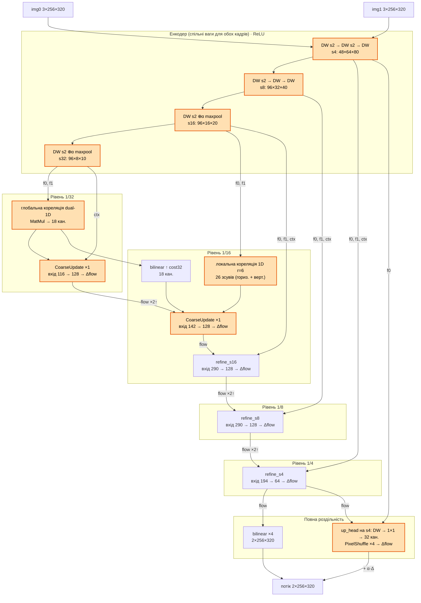
```mermaid
flowchart TB
    I0["img0 3×256×320"]
    I1["img1 3×256×320"]
  subgraph G_enc["Енкодер (спільні ваги для обох кадрів) · ReLU"]
    direction TB
    E4["DW s2 → DW s2 → DW<br/>s4: 48×64×80"]
    E8["DW s2 → DW → DW<br/>s8: 96×32×40"]
    E16["DW s2 ⊕α maxpool<br/>s16: 96×16×20"]
    E32["DW s2 ⊕α maxpool<br/>s32: 96×8×10"]
  end
  subgraph G_s32["Рівень 1/32"]
    direction TB
    C32["глобальна кореляція dual-1D<br/>MatMul → 18 кан."]
    U32["CoarseUpdate ×1<br/>вхід 116 → 128 → Δflow"]
  end
  subgraph G_s16["Рівень 1/16"]
    direction TB
    C16["локальна кореляція 1D r=6<br/>26 зсувів (гориз. + верт.)"]
    UP32["bilinear ↑ cost32<br/>18 кан."]
    U16["CoarseUpdate ×1<br/>вхід 142 → 128 → Δflow"]
    R16["refine_s16<br/>вхід 290 → 128 → Δflow"]
  end
  subgraph G_s8["Рівень 1/8"]
    direction TB
    R8["refine_s8<br/>вхід 290 → 128 → Δflow"]
  end
  subgraph G_s4["Рівень 1/4"]
    direction TB
    R4["refine_s4<br/>вхід 194 → 64 → Δflow"]
  end
  subgraph G_full["Повна роздільність"]
    direction TB
    UPF["bilinear ×4<br/>2×256×320"]
    FR["up_head на s4: DW → 1×1 → 32 кан.<br/>PixelShuffle ×4 → Δflow"]
  end
    OUT["потік 2×256×320"]
  I0 --> E4
  I1 --> E4
  E4 --> E8
  E8 --> E16
  E16 --> E32
  E32 -->|f0, f1| C32
  C32 --> U32
  E32 -->|ctx| U32
  E16 -->|f0, f1| C16
  C16 --> U16
  U16 -->|flow| R16
  E16 -->|f0, f1, ctx| R16
  C32 --> UP32
  UP32 --> U16
  U32 -->|flow ×2↑| U16
  R16 -->|flow ×2↑| R8
  E8 -->|f0, f1, ctx| R8
  R8 -->|flow ×2↑| R4
  E4 -->|f0, f1, ctx| R4
  R4 -->|flow| UPF
  R4 -->|flow| FR
  E4 -->|f0| FR
  UPF --> OUT
  FR -->|+ α·Δ| OUT
  classDef changed fill:#ffe0b2,stroke:#e65100,stroke-width:2px,color:#000
  class E4,E8,E16,E32,C32,U32,C16,U16,FR changed
```

## C5_r4_ps_nopos_relu

Зміни відносно B0: `r16: 4`, `full_refine: pixelshuffle`, `use_pos_enc: False`, `act: relu`. Параметрів: 0.464 M. Час на MaixCAM: INT8 15.20 мс, mixed 15.65 мс.

Активація ReLU в усіх блоках (у B0 — LeakyReLU); вузли через це не підсвічено.

```mermaid
flowchart TB
    I0["img0 3×256×320"]
    I1["img1 3×256×320"]
  subgraph G_enc["Енкодер (спільні ваги для обох кадрів) · ReLU"]
    direction TB
    E4["DW s2 → DW s2 → DW<br/>s4: 48×64×80"]
    E8["DW s2 → DW → DW + SE<br/>s8: 96×32×40"]
    E16["DW s2 ⊕α maxpool + SE<br/>s16: 96×16×20"]
    E32["DW s2 ⊕α maxpool + SE<br/>s32: 96×8×10"]
  end
  subgraph G_s32["Рівень 1/32"]
    direction TB
    C32["глобальна кореляція dual-1D<br/>l2norm, MatMul → 18 кан."]
    U32["CoarseUpdate ×2<br/>вхід 116 → 128 → Δflow"]
  end
  subgraph G_s16["Рівень 1/16"]
    direction TB
    C16["локальна кореляція 2D r=4<br/>l2norm, 81 зсувів"]
    UP32["bilinear ↑ cost32<br/>18 кан."]
    U16["CoarseUpdate ×2<br/>вхід 197 → 128 → Δflow"]
    R16["refine_s16<br/>вхід 290 → 128 → Δflow"]
  end
  subgraph G_s8["Рівень 1/8"]
    direction TB
    R8["refine_s8<br/>вхід 290 → 128 → Δflow"]
  end
  subgraph G_s4["Рівень 1/4"]
    direction TB
    R4["refine_s4<br/>вхід 194 → 64 → Δflow"]
  end
  subgraph G_full["Повна роздільність"]
    direction TB
    UPF["bilinear ×4<br/>2×256×320"]
    FR["up_head на s4: DW → 1×1 → 32 кан.<br/>PixelShuffle ×4 → Δflow"]
  end
    OUT["потік 2×256×320"]
  I0 --> E4
  I1 --> E4
  E4 --> E8
  E8 --> E16
  E16 --> E32
  E32 -->|f0, f1| C32
  C32 --> U32
  E32 -->|ctx| U32
  E16 -->|f0, f1| C16
  C16 --> U16
  U16 -->|flow| R16
  E16 -->|f0, f1, ctx| R16
  C32 --> UP32
  UP32 --> U16
  U32 -->|flow ×2↑| U16
  R16 -->|flow ×2↑| R8
  E8 -->|f0, f1, ctx| R8
  R8 -->|flow ×2↑| R4
  E4 -->|f0, f1, ctx| R4
  R4 -->|flow| UPF
  R4 -->|flow| FR
  E4 -->|f0| FR
  UPF --> OUT
  FR -->|+ α·Δ| OUT
  classDef changed fill:#ffe0b2,stroke:#e65100,stroke-width:2px,color:#000
  class E4,E8,E16,E32,C16,U16,FR changed
```

## C6_1d_norefine_nopos_relu

Зміни відносно B0: `corr16: 1d`, `full_refine: none`, `use_pos_enc: False`, `act: relu`. Параметрів: 0.451 M. Час на MaixCAM: INT8 10.48 мс, mixed 11.12 мс.

Активація ReLU в усіх блоках (у B0 — LeakyReLU); вузли через це не підсвічено.

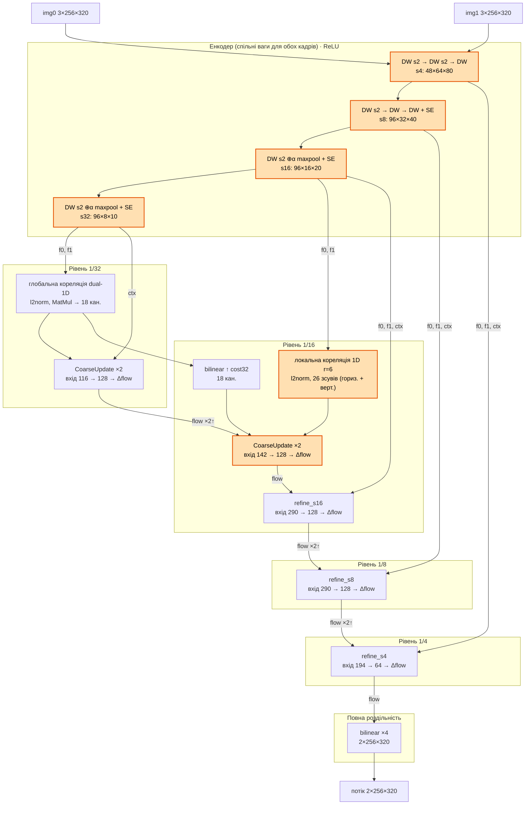
```mermaid
flowchart TB
    I0["img0 3×256×320"]
    I1["img1 3×256×320"]
  subgraph G_enc["Енкодер (спільні ваги для обох кадрів) · ReLU"]
    direction TB
    E4["DW s2 → DW s2 → DW<br/>s4: 48×64×80"]
    E8["DW s2 → DW → DW + SE<br/>s8: 96×32×40"]
    E16["DW s2 ⊕α maxpool + SE<br/>s16: 96×16×20"]
    E32["DW s2 ⊕α maxpool + SE<br/>s32: 96×8×10"]
  end
  subgraph G_s32["Рівень 1/32"]
    direction TB
    C32["глобальна кореляція dual-1D<br/>l2norm, MatMul → 18 кан."]
    U32["CoarseUpdate ×2<br/>вхід 116 → 128 → Δflow"]
  end
  subgraph G_s16["Рівень 1/16"]
    direction TB
    C16["локальна кореляція 1D r=6<br/>l2norm, 26 зсувів (гориз. + верт.)"]
    UP32["bilinear ↑ cost32<br/>18 кан."]
    U16["CoarseUpdate ×2<br/>вхід 142 → 128 → Δflow"]
    R16["refine_s16<br/>вхід 290 → 128 → Δflow"]
  end
  subgraph G_s8["Рівень 1/8"]
    direction TB
    R8["refine_s8<br/>вхід 290 → 128 → Δflow"]
  end
  subgraph G_s4["Рівень 1/4"]
    direction TB
    R4["refine_s4<br/>вхід 194 → 64 → Δflow"]
  end
  subgraph G_full["Повна роздільність"]
    direction TB
    UPF["bilinear ×4<br/>2×256×320"]
  end
    OUT["потік 2×256×320"]
  I0 --> E4
  I1 --> E4
  E4 --> E8
  E8 --> E16
  E16 --> E32
  E32 -->|f0, f1| C32
  C32 --> U32
  E32 -->|ctx| U32
  E16 -->|f0, f1| C16
  C16 --> U16
  U16 -->|flow| R16
  E16 -->|f0, f1, ctx| R16
  C32 --> UP32
  UP32 --> U16
  U32 -->|flow ×2↑| U16
  R16 -->|flow ×2↑| R8
  E8 -->|f0, f1, ctx| R8
  R8 -->|flow ×2↑| R4
  E4 -->|f0, f1, ctx| R4
  R4 -->|flow| UPF
  UPF --> OUT
  classDef changed fill:#ffe0b2,stroke:#e65100,stroke-width:2px,color:#000
  class E4,E8,E16,E32,C16,U16 changed
```

Прибрано відносно B0: full_refine на 256×320, DW + dilated DW + 1×1, вхід flow + img0.

## V1_global1d_sa

Зміни відносно B0: `corr16: 1d`, `full_refine: pixelshuffle`, `use_pos_enc: False`, `act: relu`, `match8: global1d`. Параметрів: 0.466 M. Час на MaixCAM: INT8 14.65 мс, mixed 15.11 мс.

Активація ReLU в усіх блоках (у B0 — LeakyReLU); вузли через це не підсвічено.

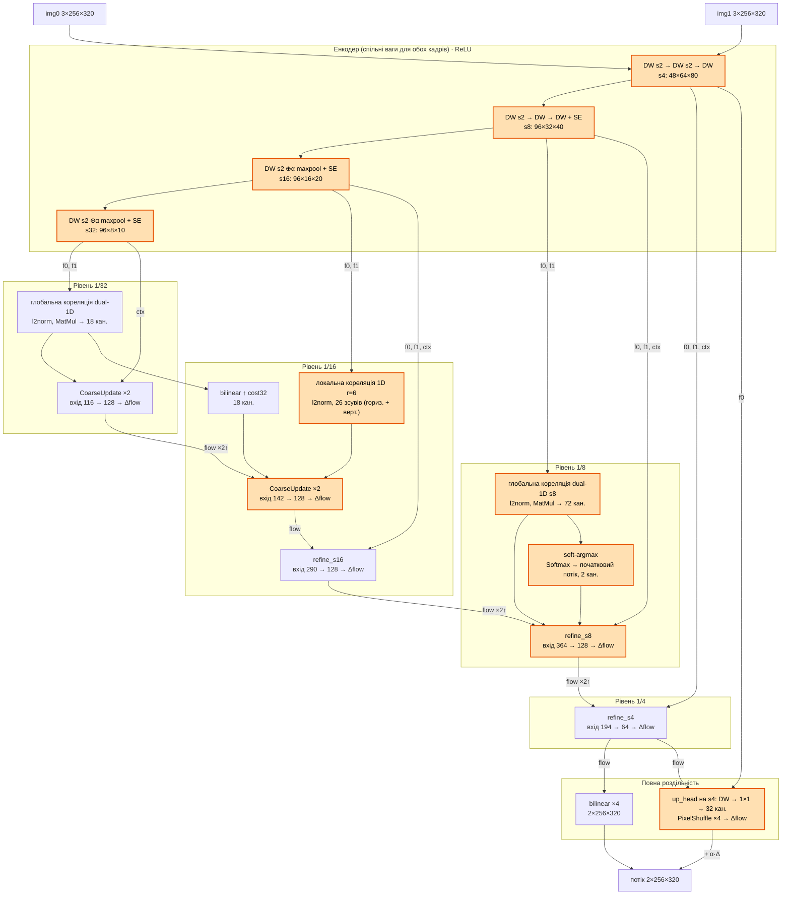
```mermaid
flowchart TB
    I0["img0 3×256×320"]
    I1["img1 3×256×320"]
  subgraph G_enc["Енкодер (спільні ваги для обох кадрів) · ReLU"]
    direction TB
    E4["DW s2 → DW s2 → DW<br/>s4: 48×64×80"]
    E8["DW s2 → DW → DW + SE<br/>s8: 96×32×40"]
    E16["DW s2 ⊕α maxpool + SE<br/>s16: 96×16×20"]
    E32["DW s2 ⊕α maxpool + SE<br/>s32: 96×8×10"]
  end
  subgraph G_s32["Рівень 1/32"]
    direction TB
    C32["глобальна кореляція dual-1D<br/>l2norm, MatMul → 18 кан."]
    U32["CoarseUpdate ×2<br/>вхід 116 → 128 → Δflow"]
  end
  subgraph G_s16["Рівень 1/16"]
    direction TB
    C16["локальна кореляція 1D r=6<br/>l2norm, 26 зсувів (гориз. + верт.)"]
    UP32["bilinear ↑ cost32<br/>18 кан."]
    U16["CoarseUpdate ×2<br/>вхід 142 → 128 → Δflow"]
    R16["refine_s16<br/>вхід 290 → 128 → Δflow"]
  end
  subgraph G_s8["Рівень 1/8"]
    direction TB
    M8["глобальна кореляція dual-1D s8<br/>l2norm, MatMul → 72 кан."]
    SA8["soft-argmax<br/>Softmax → початковий потік, 2 кан."]
    R8["refine_s8<br/>вхід 364 → 128 → Δflow"]
  end
  subgraph G_s4["Рівень 1/4"]
    direction TB
    R4["refine_s4<br/>вхід 194 → 64 → Δflow"]
  end
  subgraph G_full["Повна роздільність"]
    direction TB
    UPF["bilinear ×4<br/>2×256×320"]
    FR["up_head на s4: DW → 1×1 → 32 кан.<br/>PixelShuffle ×4 → Δflow"]
  end
    OUT["потік 2×256×320"]
  I0 --> E4
  I1 --> E4
  E4 --> E8
  E8 --> E16
  E16 --> E32
  E32 -->|f0, f1| C32
  C32 --> U32
  E32 -->|ctx| U32
  E16 -->|f0, f1| C16
  C16 --> U16
  U16 -->|flow| R16
  E16 -->|f0, f1, ctx| R16
  C32 --> UP32
  UP32 --> U16
  U32 -->|flow ×2↑| U16
  E8 -->|f0, f1| M8
  M8 --> R8
  M8 --> SA8
  SA8 --> R8
  R16 -->|flow ×2↑| R8
  E8 -->|f0, f1, ctx| R8
  R8 -->|flow ×2↑| R4
  E4 -->|f0, f1, ctx| R4
  R4 -->|flow| UPF
  R4 -->|flow| FR
  E4 -->|f0| FR
  UPF --> OUT
  FR -->|+ α·Δ| OUT
  classDef changed fill:#ffe0b2,stroke:#e65100,stroke-width:2px,color:#000
  class E4,E8,E16,E32,C16,U16,M8,SA8,R8,FR changed
```

## V1b_global1d_sa_loc2

Зміни відносно B0: `corr16: 1d`, `full_refine: pixelshuffle`, `use_pos_enc: False`, `act: relu`, `match8: global1d`, `match8_local_r: 2`. Параметрів: 0.469 M. Час на MaixCAM: INT8 19.50 мс, mixed 19.96 мс.

Активація ReLU в усіх блоках (у B0 — LeakyReLU); вузли через це не підсвічено.

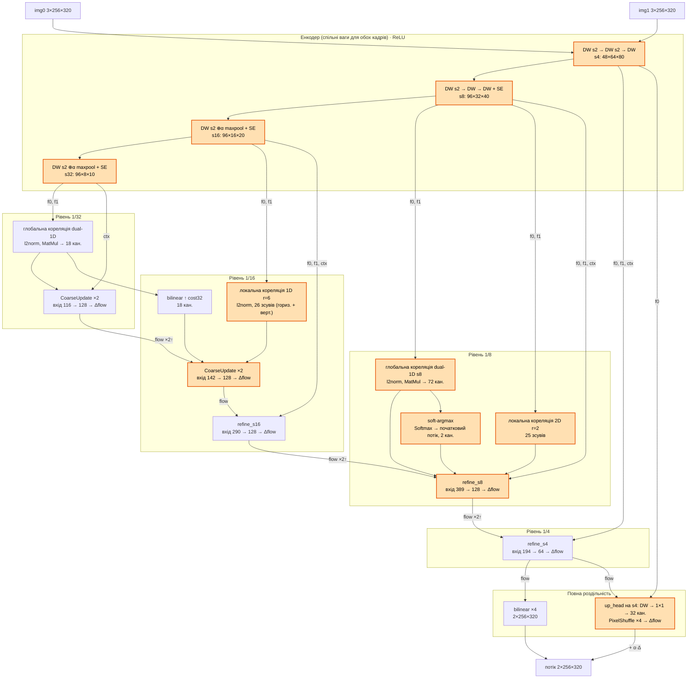
```mermaid
flowchart TB
    I0["img0 3×256×320"]
    I1["img1 3×256×320"]
  subgraph G_enc["Енкодер (спільні ваги для обох кадрів) · ReLU"]
    direction TB
    E4["DW s2 → DW s2 → DW<br/>s4: 48×64×80"]
    E8["DW s2 → DW → DW + SE<br/>s8: 96×32×40"]
    E16["DW s2 ⊕α maxpool + SE<br/>s16: 96×16×20"]
    E32["DW s2 ⊕α maxpool + SE<br/>s32: 96×8×10"]
  end
  subgraph G_s32["Рівень 1/32"]
    direction TB
    C32["глобальна кореляція dual-1D<br/>l2norm, MatMul → 18 кан."]
    U32["CoarseUpdate ×2<br/>вхід 116 → 128 → Δflow"]
  end
  subgraph G_s16["Рівень 1/16"]
    direction TB
    C16["локальна кореляція 1D r=6<br/>l2norm, 26 зсувів (гориз. + верт.)"]
    UP32["bilinear ↑ cost32<br/>18 кан."]
    U16["CoarseUpdate ×2<br/>вхід 142 → 128 → Δflow"]
    R16["refine_s16<br/>вхід 290 → 128 → Δflow"]
  end
  subgraph G_s8["Рівень 1/8"]
    direction TB
    M8["глобальна кореляція dual-1D s8<br/>l2norm, MatMul → 72 кан."]
    SA8["soft-argmax<br/>Softmax → початковий потік, 2 кан."]
    L8["локальна кореляція 2D r=2<br/>25 зсувів"]
    R8["refine_s8<br/>вхід 389 → 128 → Δflow"]
  end
  subgraph G_s4["Рівень 1/4"]
    direction TB
    R4["refine_s4<br/>вхід 194 → 64 → Δflow"]
  end
  subgraph G_full["Повна роздільність"]
    direction TB
    UPF["bilinear ×4<br/>2×256×320"]
    FR["up_head на s4: DW → 1×1 → 32 кан.<br/>PixelShuffle ×4 → Δflow"]
  end
    OUT["потік 2×256×320"]
  I0 --> E4
  I1 --> E4
  E4 --> E8
  E8 --> E16
  E16 --> E32
  E32 -->|f0, f1| C32
  C32 --> U32
  E32 -->|ctx| U32
  E16 -->|f0, f1| C16
  C16 --> U16
  U16 -->|flow| R16
  E16 -->|f0, f1, ctx| R16
  C32 --> UP32
  UP32 --> U16
  U32 -->|flow ×2↑| U16
  E8 -->|f0, f1| M8
  M8 --> R8
  M8 --> SA8
  SA8 --> R8
  E8 -->|f0, f1| L8
  L8 --> R8
  R16 -->|flow ×2↑| R8
  E8 -->|f0, f1, ctx| R8
  R8 -->|flow ×2↑| R4
  E4 -->|f0, f1, ctx| R4
  R4 -->|flow| UPF
  R4 -->|flow| FR
  E4 -->|f0| FR
  UPF --> OUT
  FR -->|+ α·Δ| OUT
  classDef changed fill:#ffe0b2,stroke:#e65100,stroke-width:2px,color:#000
  class E4,E8,E16,E32,C16,U16,M8,SA8,L8,R8,FR changed
```

## V1c_global1d_sa_nof1

Зміни відносно B0: `corr16: 1d`, `full_refine: pixelshuffle`, `use_pos_enc: False`, `act: relu`, `match8: global1d`, `refine8_f1: False`. Параметрів: 0.454 M. Час на MaixCAM: INT8 14.23 мс, mixed 14.68 мс.

Активація ReLU в усіх блоках (у B0 — LeakyReLU); вузли через це не підсвічено.

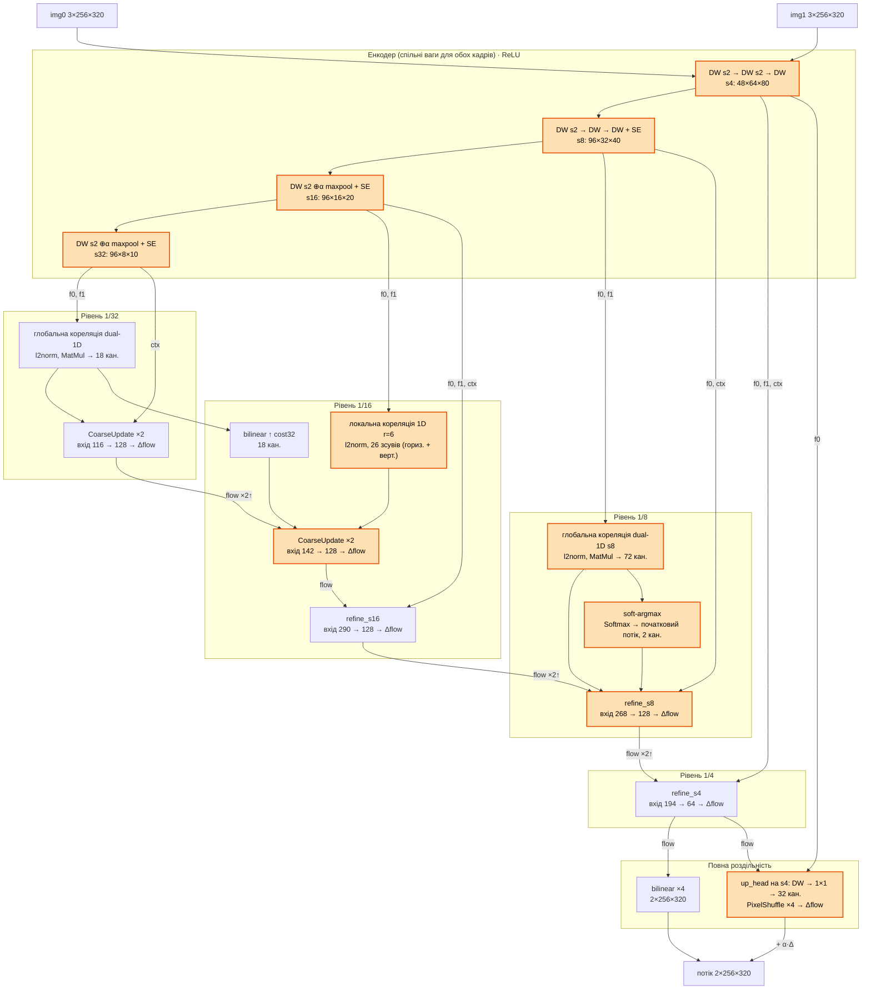
```mermaid
flowchart TB
    I0["img0 3×256×320"]
    I1["img1 3×256×320"]
  subgraph G_enc["Енкодер (спільні ваги для обох кадрів) · ReLU"]
    direction TB
    E4["DW s2 → DW s2 → DW<br/>s4: 48×64×80"]
    E8["DW s2 → DW → DW + SE<br/>s8: 96×32×40"]
    E16["DW s2 ⊕α maxpool + SE<br/>s16: 96×16×20"]
    E32["DW s2 ⊕α maxpool + SE<br/>s32: 96×8×10"]
  end
  subgraph G_s32["Рівень 1/32"]
    direction TB
    C32["глобальна кореляція dual-1D<br/>l2norm, MatMul → 18 кан."]
    U32["CoarseUpdate ×2<br/>вхід 116 → 128 → Δflow"]
  end
  subgraph G_s16["Рівень 1/16"]
    direction TB
    C16["локальна кореляція 1D r=6<br/>l2norm, 26 зсувів (гориз. + верт.)"]
    UP32["bilinear ↑ cost32<br/>18 кан."]
    U16["CoarseUpdate ×2<br/>вхід 142 → 128 → Δflow"]
    R16["refine_s16<br/>вхід 290 → 128 → Δflow"]
  end
  subgraph G_s8["Рівень 1/8"]
    direction TB
    M8["глобальна кореляція dual-1D s8<br/>l2norm, MatMul → 72 кан."]
    SA8["soft-argmax<br/>Softmax → початковий потік, 2 кан."]
    R8["refine_s8<br/>вхід 268 → 128 → Δflow"]
  end
  subgraph G_s4["Рівень 1/4"]
    direction TB
    R4["refine_s4<br/>вхід 194 → 64 → Δflow"]
  end
  subgraph G_full["Повна роздільність"]
    direction TB
    UPF["bilinear ×4<br/>2×256×320"]
    FR["up_head на s4: DW → 1×1 → 32 кан.<br/>PixelShuffle ×4 → Δflow"]
  end
    OUT["потік 2×256×320"]
  I0 --> E4
  I1 --> E4
  E4 --> E8
  E8 --> E16
  E16 --> E32
  E32 -->|f0, f1| C32
  C32 --> U32
  E32 -->|ctx| U32
  E16 -->|f0, f1| C16
  C16 --> U16
  U16 -->|flow| R16
  E16 -->|f0, f1, ctx| R16
  C32 --> UP32
  UP32 --> U16
  U32 -->|flow ×2↑| U16
  E8 -->|f0, f1| M8
  M8 --> R8
  M8 --> SA8
  SA8 --> R8
  R16 -->|flow ×2↑| R8
  E8 -->|f0, ctx| R8
  R8 -->|flow ×2↑| R4
  E4 -->|f0, f1, ctx| R4
  R4 -->|flow| UPF
  R4 -->|flow| FR
  E4 -->|f0| FR
  UPF --> OUT
  FR -->|+ α·Δ| OUT
  classDef changed fill:#ffe0b2,stroke:#e65100,stroke-width:2px,color:#000
  class E4,E8,E16,E32,C16,U16,M8,SA8,R8,FR changed
```

## V1d_global1d_nosa

Зміни відносно B0: `corr16: 1d`, `full_refine: pixelshuffle`, `use_pos_enc: False`, `act: relu`, `match8: global1d`, `match8_softargmax: False`. Параметрів: 0.466 M. Час на MaixCAM: INT8 13.34 мс, mixed 13.80 мс.

Активація ReLU в усіх блоках (у B0 — LeakyReLU); вузли через це не підсвічено.

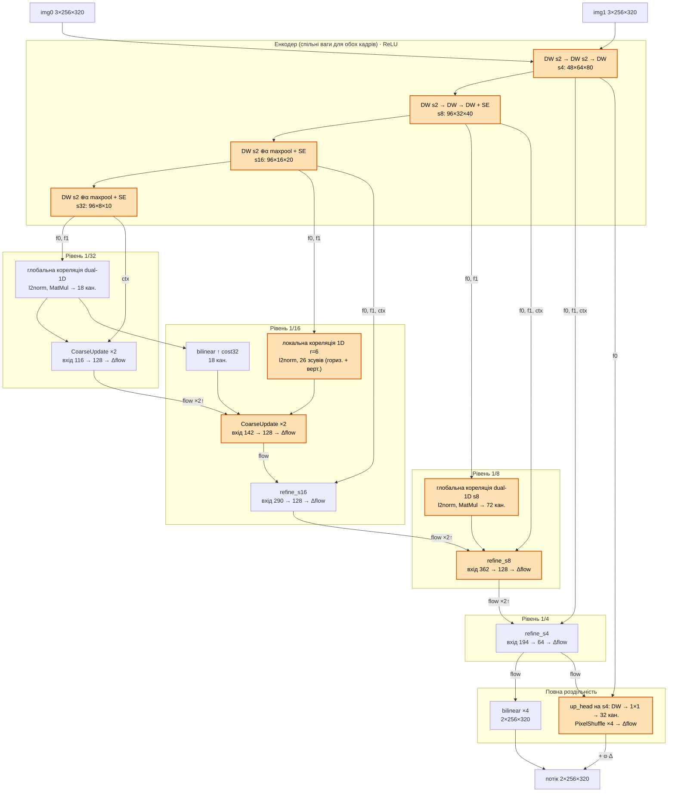
```mermaid
flowchart TB
    I0["img0 3×256×320"]
    I1["img1 3×256×320"]
  subgraph G_enc["Енкодер (спільні ваги для обох кадрів) · ReLU"]
    direction TB
    E4["DW s2 → DW s2 → DW<br/>s4: 48×64×80"]
    E8["DW s2 → DW → DW + SE<br/>s8: 96×32×40"]
    E16["DW s2 ⊕α maxpool + SE<br/>s16: 96×16×20"]
    E32["DW s2 ⊕α maxpool + SE<br/>s32: 96×8×10"]
  end
  subgraph G_s32["Рівень 1/32"]
    direction TB
    C32["глобальна кореляція dual-1D<br/>l2norm, MatMul → 18 кан."]
    U32["CoarseUpdate ×2<br/>вхід 116 → 128 → Δflow"]
  end
  subgraph G_s16["Рівень 1/16"]
    direction TB
    C16["локальна кореляція 1D r=6<br/>l2norm, 26 зсувів (гориз. + верт.)"]
    UP32["bilinear ↑ cost32<br/>18 кан."]
    U16["CoarseUpdate ×2<br/>вхід 142 → 128 → Δflow"]
    R16["refine_s16<br/>вхід 290 → 128 → Δflow"]
  end
  subgraph G_s8["Рівень 1/8"]
    direction TB
    M8["глобальна кореляція dual-1D s8<br/>l2norm, MatMul → 72 кан."]
    R8["refine_s8<br/>вхід 362 → 128 → Δflow"]
  end
  subgraph G_s4["Рівень 1/4"]
    direction TB
    R4["refine_s4<br/>вхід 194 → 64 → Δflow"]
  end
  subgraph G_full["Повна роздільність"]
    direction TB
    UPF["bilinear ×4<br/>2×256×320"]
    FR["up_head на s4: DW → 1×1 → 32 кан.<br/>PixelShuffle ×4 → Δflow"]
  end
    OUT["потік 2×256×320"]
  I0 --> E4
  I1 --> E4
  E4 --> E8
  E8 --> E16
  E16 --> E32
  E32 -->|f0, f1| C32
  C32 --> U32
  E32 -->|ctx| U32
  E16 -->|f0, f1| C16
  C16 --> U16
  U16 -->|flow| R16
  E16 -->|f0, f1, ctx| R16
  C32 --> UP32
  UP32 --> U16
  U32 -->|flow ×2↑| U16
  E8 -->|f0, f1| M8
  M8 --> R8
  R16 -->|flow ×2↑| R8
  E8 -->|f0, f1, ctx| R8
  R8 -->|flow ×2↑| R4
  E4 -->|f0, f1, ctx| R4
  R4 -->|flow| UPF
  R4 -->|flow| FR
  E4 -->|f0| FR
  UPF --> OUT
  FR -->|+ α·Δ| OUT
  classDef changed fill:#ffe0b2,stroke:#e65100,stroke-width:2px,color:#000
  class E4,E8,E16,E32,C16,U16,M8,R8,FR changed
```

## V2_kpn_r4

Зміни відносно B0: `corr16: 1d`, `full_refine: pixelshuffle`, `use_pos_enc: False`, `act: relu`, `warp8: kpn`, `kpn_r8: 4`. Параметрів: 0.486 M. Час на MaixCAM: INT8 16.40 мс, mixed 16.85 мс.

Активація ReLU в усіх блоках (у B0 — LeakyReLU); вузли через це не підсвічено.

```mermaid
flowchart TB
    I0["img0 3×256×320"]
    I1["img1 3×256×320"]
  subgraph G_enc["Енкодер (спільні ваги для обох кадрів) · ReLU"]
    direction TB
    E4["DW s2 → DW s2 → DW<br/>s4: 48×64×80"]
    E8["DW s2 → DW → DW + SE<br/>s8: 96×32×40"]
    E16["DW s2 ⊕α maxpool + SE<br/>s16: 96×16×20"]
    E32["DW s2 ⊕α maxpool + SE<br/>s32: 96×8×10"]
  end
  subgraph G_s32["Рівень 1/32"]
    direction TB
    C32["глобальна кореляція dual-1D<br/>l2norm, MatMul → 18 кан."]
    U32["CoarseUpdate ×2<br/>вхід 116 → 128 → Δflow"]
  end
  subgraph G_s16["Рівень 1/16"]
    direction TB
    C16["локальна кореляція 1D r=6<br/>l2norm, 26 зсувів (гориз. + верт.)"]
    UP32["bilinear ↑ cost32<br/>18 кан."]
    U16["CoarseUpdate ×2<br/>вхід 142 → 128 → Δflow"]
    R16["refine_s16<br/>вхід 290 → 128 → Δflow"]
  end
  subgraph G_s8["Рівень 1/8"]
    direction TB
    K8["сепарабельне KPN-зміщення f1<br/>ядро 9+9, без GridSample"]
    R8["refine_s8<br/>вхід 290 → 128 → Δflow"]
  end
  subgraph G_s4["Рівень 1/4"]
    direction TB
    R4["refine_s4<br/>вхід 194 → 64 → Δflow"]
  end
  subgraph G_full["Повна роздільність"]
    direction TB
    UPF["bilinear ×4<br/>2×256×320"]
    FR["up_head на s4: DW → 1×1 → 32 кан.<br/>PixelShuffle ×4 → Δflow"]
  end
    OUT["потік 2×256×320"]
  I0 --> E4
  I1 --> E4
  E4 --> E8
  E8 --> E16
  E16 --> E32
  E32 -->|f0, f1| C32
  C32 --> U32
  E32 -->|ctx| U32
  E16 -->|f0, f1| C16
  C16 --> U16
  U16 -->|flow| R16
  E16 -->|f0, f1, ctx| R16
  C32 --> UP32
  UP32 --> U16
  U32 -->|flow ×2↑| U16
  E8 -->|f1| K8
  R16 -->|flow, ctx| K8
  K8 -->|f1 зміщений| R8
  R16 -->|flow ×2↑| R8
  E8 -->|f0, ctx| R8
  R8 -->|flow ×2↑| R4
  E4 -->|f0, f1, ctx| R4
  R4 -->|flow| UPF
  R4 -->|flow| FR
  E4 -->|f0| FR
  UPF --> OUT
  FR -->|+ α·Δ| OUT
  classDef changed fill:#ffe0b2,stroke:#e65100,stroke-width:2px,color:#000
  class E4,E8,E16,E32,C16,U16,K8,FR changed
```

## V2b_kpn_r4_global1d

Зміни відносно B0: `corr16: 1d`, `full_refine: pixelshuffle`, `use_pos_enc: False`, `act: relu`, `warp8: kpn`, `kpn_r8: 4`, `match8: global1d`. Параметрів: 0.495 M. Час на MaixCAM: INT8 20.01 мс, mixed 20.48 мс.

Активація ReLU в усіх блоках (у B0 — LeakyReLU); вузли через це не підсвічено.

```mermaid
flowchart TB
    I0["img0 3×256×320"]
    I1["img1 3×256×320"]
  subgraph G_enc["Енкодер (спільні ваги для обох кадрів) · ReLU"]
    direction TB
    E4["DW s2 → DW s2 → DW<br/>s4: 48×64×80"]
    E8["DW s2 → DW → DW + SE<br/>s8: 96×32×40"]
    E16["DW s2 ⊕α maxpool + SE<br/>s16: 96×16×20"]
    E32["DW s2 ⊕α maxpool + SE<br/>s32: 96×8×10"]
  end
  subgraph G_s32["Рівень 1/32"]
    direction TB
    C32["глобальна кореляція dual-1D<br/>l2norm, MatMul → 18 кан."]
    U32["CoarseUpdate ×2<br/>вхід 116 → 128 → Δflow"]
  end
  subgraph G_s16["Рівень 1/16"]
    direction TB
    C16["локальна кореляція 1D r=6<br/>l2norm, 26 зсувів (гориз. + верт.)"]
    UP32["bilinear ↑ cost32<br/>18 кан."]
    U16["CoarseUpdate ×2<br/>вхід 142 → 128 → Δflow"]
    R16["refine_s16<br/>вхід 290 → 128 → Δflow"]
  end
  subgraph G_s8["Рівень 1/8"]
    direction TB
    M8["глобальна кореляція dual-1D s8<br/>l2norm, MatMul → 72 кан."]
    SA8["soft-argmax<br/>Softmax → початковий потік, 2 кан."]
    K8["сепарабельне KPN-зміщення f1<br/>ядро 9+9, без GridSample"]
    R8["refine_s8<br/>вхід 364 → 128 → Δflow"]
  end
  subgraph G_s4["Рівень 1/4"]
    direction TB
    R4["refine_s4<br/>вхід 194 → 64 → Δflow"]
  end
  subgraph G_full["Повна роздільність"]
    direction TB
    UPF["bilinear ×4<br/>2×256×320"]
    FR["up_head на s4: DW → 1×1 → 32 кан.<br/>PixelShuffle ×4 → Δflow"]
  end
    OUT["потік 2×256×320"]
  I0 --> E4
  I1 --> E4
  E4 --> E8
  E8 --> E16
  E16 --> E32
  E32 -->|f0, f1| C32
  C32 --> U32
  E32 -->|ctx| U32
  E16 -->|f0, f1| C16
  C16 --> U16
  U16 -->|flow| R16
  E16 -->|f0, f1, ctx| R16
  C32 --> UP32
  UP32 --> U16
  U32 -->|flow ×2↑| U16
  E8 -->|f0, f1| M8
  M8 --> R8
  M8 --> SA8
  SA8 --> R8
  E8 -->|f1| K8
  R16 -->|flow, ctx| K8
  K8 -->|f1 зміщений| R8
  R16 -->|flow ×2↑| R8
  E8 -->|f0, ctx| R8
  R8 -->|flow ×2↑| R4
  E4 -->|f0, f1, ctx| R4
  R4 -->|flow| UPF
  R4 -->|flow| FR
  E4 -->|f0| FR
  UPF --> OUT
  FR -->|+ α·Δ| OUT
  classDef changed fill:#ffe0b2,stroke:#e65100,stroke-width:2px,color:#000
  class E4,E8,E16,E32,C16,U16,M8,SA8,K8,R8,FR changed
```

## V3_dcv_r2_d124

Зміни відносно B0: `corr16: 1d`, `full_refine: pixelshuffle`, `use_pos_enc: False`, `act: relu`, `match8: dcv`, `r8: 2`, `dcv_dilations: [1, 2, 4]`. Параметрів: 0.466 M. Час на MaixCAM: INT8 27.07 мс, mixed 27.53 мс.

Активація ReLU в усіх блоках (у B0 — LeakyReLU); вузли через це не підсвічено.

```mermaid
flowchart TB
    I0["img0 3×256×320"]
    I1["img1 3×256×320"]
  subgraph G_enc["Енкодер (спільні ваги для обох кадрів) · ReLU"]
    direction TB
    E4["DW s2 → DW s2 → DW<br/>s4: 48×64×80"]
    E8["DW s2 → DW → DW + SE<br/>s8: 96×32×40"]
    E16["DW s2 ⊕α maxpool + SE<br/>s16: 96×16×20"]
    E32["DW s2 ⊕α maxpool + SE<br/>s32: 96×8×10"]
  end
  subgraph G_s32["Рівень 1/32"]
    direction TB
    C32["глобальна кореляція dual-1D<br/>l2norm, MatMul → 18 кан."]
    U32["CoarseUpdate ×2<br/>вхід 116 → 128 → Δflow"]
  end
  subgraph G_s16["Рівень 1/16"]
    direction TB
    C16["локальна кореляція 1D r=6<br/>l2norm, 26 зсувів (гориз. + верт.)"]
    UP32["bilinear ↑ cost32<br/>18 кан."]
    U16["CoarseUpdate ×2<br/>вхід 142 → 128 → Δflow"]
    R16["refine_s16<br/>вхід 290 → 128 → Δflow"]
  end
  subgraph G_s8["Рівень 1/8"]
    direction TB
    M8["розріджена кореляція 2D r=2<br/>дилатації 1, 2, 4 → 75 зсувів"]
    R8["refine_s8<br/>вхід 365 → 128 → Δflow"]
  end
  subgraph G_s4["Рівень 1/4"]
    direction TB
    R4["refine_s4<br/>вхід 194 → 64 → Δflow"]
  end
  subgraph G_full["Повна роздільність"]
    direction TB
    UPF["bilinear ×4<br/>2×256×320"]
    FR["up_head на s4: DW → 1×1 → 32 кан.<br/>PixelShuffle ×4 → Δflow"]
  end
    OUT["потік 2×256×320"]
  I0 --> E4
  I1 --> E4
  E4 --> E8
  E8 --> E16
  E16 --> E32
  E32 -->|f0, f1| C32
  C32 --> U32
  E32 -->|ctx| U32
  E16 -->|f0, f1| C16
  C16 --> U16
  U16 -->|flow| R16
  E16 -->|f0, f1, ctx| R16
  C32 --> UP32
  UP32 --> U16
  U32 -->|flow ×2↑| U16
  E8 -->|f0, f1| M8
  M8 --> R8
  R16 -->|flow ×2↑| R8
  E8 -->|f0, f1, ctx| R8
  R8 -->|flow ×2↑| R4
  E4 -->|f0, f1, ctx| R4
  R4 -->|flow| UPF
  R4 -->|flow| FR
  E4 -->|f0| FR
  UPF --> OUT
  FR -->|+ α·Δ| OUT
  classDef changed fill:#ffe0b2,stroke:#e65100,stroke-width:2px,color:#000
  class E4,E8,E16,E32,C16,U16,M8,R8,FR changed
```

## A1_local1d_r4

Зміни відносно B0: `corr16: 1d`, `full_refine: pixelshuffle`, `use_pos_enc: False`, `act: relu`, `match8: local1d`, `r8: 4`. Параметрів: 0.459 M. Час на MaixCAM: INT8 15.97 мс, mixed 16.41 мс.

Активація ReLU в усіх блоках (у B0 — LeakyReLU); вузли через це не підсвічено.

```mermaid
flowchart TB
    I0["img0 3×256×320"]
    I1["img1 3×256×320"]
  subgraph G_enc["Енкодер (спільні ваги для обох кадрів) · ReLU"]
    direction TB
    E4["DW s2 → DW s2 → DW<br/>s4: 48×64×80"]
    E8["DW s2 → DW → DW + SE<br/>s8: 96×32×40"]
    E16["DW s2 ⊕α maxpool + SE<br/>s16: 96×16×20"]
    E32["DW s2 ⊕α maxpool + SE<br/>s32: 96×8×10"]
  end
  subgraph G_s32["Рівень 1/32"]
    direction TB
    C32["глобальна кореляція dual-1D<br/>l2norm, MatMul → 18 кан."]
    U32["CoarseUpdate ×2<br/>вхід 116 → 128 → Δflow"]
  end
  subgraph G_s16["Рівень 1/16"]
    direction TB
    C16["локальна кореляція 1D r=6<br/>l2norm, 26 зсувів (гориз. + верт.)"]
    UP32["bilinear ↑ cost32<br/>18 кан."]
    U16["CoarseUpdate ×2<br/>вхід 142 → 128 → Δflow"]
    R16["refine_s16<br/>вхід 290 → 128 → Δflow"]
  end
  subgraph G_s8["Рівень 1/8"]
    direction TB
    M8["локальна кореляція 1D r=4<br/>18 зсувів"]
    R8["refine_s8<br/>вхід 308 → 128 → Δflow"]
  end
  subgraph G_s4["Рівень 1/4"]
    direction TB
    R4["refine_s4<br/>вхід 194 → 64 → Δflow"]
  end
  subgraph G_full["Повна роздільність"]
    direction TB
    UPF["bilinear ×4<br/>2×256×320"]
    FR["up_head на s4: DW → 1×1 → 32 кан.<br/>PixelShuffle ×4 → Δflow"]
  end
    OUT["потік 2×256×320"]
  I0 --> E4
  I1 --> E4
  E4 --> E8
  E8 --> E16
  E16 --> E32
  E32 -->|f0, f1| C32
  C32 --> U32
  E32 -->|ctx| U32
  E16 -->|f0, f1| C16
  C16 --> U16
  U16 -->|flow| R16
  E16 -->|f0, f1, ctx| R16
  C32 --> UP32
  UP32 --> U16
  U32 -->|flow ×2↑| U16
  E8 -->|f0, f1| M8
  M8 --> R8
  R16 -->|flow ×2↑| R8
  E8 -->|f0, f1, ctx| R8
  R8 -->|flow ×2↑| R4
  E4 -->|f0, f1, ctx| R4
  R4 -->|flow| UPF
  R4 -->|flow| FR
  E4 -->|f0| FR
  UPF --> OUT
  FR -->|+ α·Δ| OUT
  classDef changed fill:#ffe0b2,stroke:#e65100,stroke-width:2px,color:#000
  class E4,E8,E16,E32,C16,U16,M8,R8,FR changed
```

## V1_B0_global1d_sa

Зміни відносно B0: `match8: global1d`. Параметрів: 0.511 M. Час на MaixCAM: INT8 32.20 мс, mixed 43.40 мс.

```mermaid
flowchart TB
    I0["img0 3×256×320"]
    I1["img1 3×256×320"]
  subgraph G_enc["Енкодер (спільні ваги для обох кадрів) · LeakyReLU"]
    direction TB
    E4["DW s2 → DW s2 → DW<br/>s4: 48×64×80<br/>+ поз. кодування (y, x), 1×1"]
    E8["DW s2 → DW → DW + SE<br/>s8: 96×32×40<br/>+ поз. кодування (y, x), 1×1"]
    E16["DW s2 ⊕α maxpool + SE<br/>s16: 96×16×20<br/>+ поз. кодування (y, x), 1×1"]
    E32["DW s2 ⊕α maxpool + SE<br/>s32: 96×8×10<br/>+ поз. кодування (y, x), 1×1"]
  end
  subgraph G_s32["Рівень 1/32"]
    direction TB
    C32["глобальна кореляція dual-1D<br/>l2norm, MatMul → 18 кан."]
    U32["CoarseUpdate ×2<br/>вхід 116 → 128 → Δflow"]
  end
  subgraph G_s16["Рівень 1/16"]
    direction TB
    C16["локальна кореляція 2D r=6<br/>l2norm, 169 зсувів"]
    UP32["bilinear ↑ cost32<br/>18 кан."]
    U16["CoarseUpdate ×2<br/>вхід 285 → 128 → Δflow"]
    R16["refine_s16<br/>вхід 290 → 128 → Δflow"]
  end
  subgraph G_s8["Рівень 1/8"]
    direction TB
    M8["глобальна кореляція dual-1D s8<br/>l2norm, MatMul → 72 кан."]
    SA8["soft-argmax<br/>Softmax → початковий потік, 2 кан."]
    R8["refine_s8<br/>вхід 364 → 128 → Δflow"]
  end
  subgraph G_s4["Рівень 1/4"]
    direction TB
    R4["refine_s4<br/>вхід 194 → 64 → Δflow"]
  end
  subgraph G_full["Повна роздільність"]
    direction TB
    UPF["bilinear ×4<br/>2×256×320"]
    FR["full_refine на 256×320<br/>DW + dilated DW + 1×1, вхід flow + img0"]
  end
    OUT["потік 2×256×320"]
  I0 --> E4
  I1 --> E4
  E4 --> E8
  E8 --> E16
  E16 --> E32
  E32 -->|f0, f1| C32
  C32 --> U32
  E32 -->|ctx| U32
  E16 -->|f0, f1| C16
  C16 --> U16
  U16 -->|flow| R16
  E16 -->|f0, f1, ctx| R16
  C32 --> UP32
  UP32 --> U16
  U32 -->|flow ×2↑| U16
  E8 -->|f0, f1| M8
  M8 --> R8
  M8 --> SA8
  SA8 --> R8
  R16 -->|flow ×2↑| R8
  E8 -->|f0, f1, ctx| R8
  R8 -->|flow ×2↑| R4
  E4 -->|f0, f1, ctx| R4
  R4 -->|flow| UPF
  UPF --> FR
  I0 -->|img0| FR
  FR --> OUT
  classDef changed fill:#ffe0b2,stroke:#e65100,stroke-width:2px,color:#000
  class M8,SA8,R8 changed
```

## S10_no_s32

Зміни відносно B0: `use_s32: False`. Параметрів: 0.398 M. Час на MaixCAM: INT8 28.85 мс, mixed 39.93 мс.

```mermaid
flowchart TB
    I0["img0 3×256×320"]
    I1["img1 3×256×320"]
  subgraph G_enc["Енкодер (спільні ваги для обох кадрів) · LeakyReLU"]
    direction TB
    E4["DW s2 → DW s2 → DW<br/>s4: 48×64×80<br/>+ поз. кодування (y, x), 1×1"]
    E8["DW s2 → DW → DW + SE<br/>s8: 96×32×40<br/>+ поз. кодування (y, x), 1×1"]
    E16["DW s2 ⊕α maxpool + SE<br/>s16: 96×16×20<br/>+ поз. кодування (y, x), 1×1"]
  end
  subgraph G_s16["Рівень 1/16"]
    direction TB
    C16["локальна кореляція 2D r=6<br/>l2norm, 169 зсувів"]
    U16["CoarseUpdate ×2<br/>вхід 267 → 128 → Δflow<br/>старт з нульового потоку"]
    R16["refine_s16<br/>вхід 290 → 128 → Δflow"]
  end
  subgraph G_s8["Рівень 1/8"]
    direction TB
    R8["refine_s8<br/>вхід 290 → 128 → Δflow"]
  end
  subgraph G_s4["Рівень 1/4"]
    direction TB
    R4["refine_s4<br/>вхід 194 → 64 → Δflow"]
  end
  subgraph G_full["Повна роздільність"]
    direction TB
    UPF["bilinear ×4<br/>2×256×320"]
    FR["full_refine на 256×320<br/>DW + dilated DW + 1×1, вхід flow + img0"]
  end
    OUT["потік 2×256×320"]
  I0 --> E4
  I1 --> E4
  E4 --> E8
  E8 --> E16
  E16 -->|f0, f1| C16
  C16 --> U16
  U16 -->|flow| R16
  E16 -->|f0, f1, ctx| R16
  R16 -->|flow ×2↑| R8
  E8 -->|f0, f1, ctx| R8
  R8 -->|flow ×2↑| R4
  E4 -->|f0, f1, ctx| R4
  R4 -->|flow| UPF
  UPF --> FR
  I0 -->|img0| FR
  FR --> OUT
  classDef changed fill:#ffe0b2,stroke:#e65100,stroke-width:2px,color:#000
  class U16 changed
```

Прибрано відносно B0: DW s2 ⊕α maxpool + SE, s32: 96×8×10, + поз. кодування (y, x), 1×1; глобальна кореляція dual-1D, l2norm, MatMul → 18 кан.; CoarseUpdate ×2, вхід 116 → 128 → Δflow; bilinear ↑ cost32, 18 кан..

## C3n_no_s32

Зміни відносно B0: `corr16: 1d`, `full_refine: pixelshuffle`, `use_pos_enc: False`, `act: relu`, `use_s32: False`. Параметрів: 0.362 M. Час на MaixCAM: INT8 10.89 мс, mixed 11.35 мс.

Активація ReLU в усіх блоках (у B0 — LeakyReLU); вузли через це не підсвічено.

```mermaid
flowchart TB
    I0["img0 3×256×320"]
    I1["img1 3×256×320"]
  subgraph G_enc["Енкодер (спільні ваги для обох кадрів) · ReLU"]
    direction TB
    E4["DW s2 → DW s2 → DW<br/>s4: 48×64×80"]
    E8["DW s2 → DW → DW + SE<br/>s8: 96×32×40"]
    E16["DW s2 ⊕α maxpool + SE<br/>s16: 96×16×20"]
  end
  subgraph G_s16["Рівень 1/16"]
    direction TB
    C16["локальна кореляція 1D r=6<br/>l2norm, 26 зсувів (гориз. + верт.)"]
    U16["CoarseUpdate ×2<br/>вхід 124 → 128 → Δflow<br/>старт з нульового потоку"]
    R16["refine_s16<br/>вхід 290 → 128 → Δflow"]
  end
  subgraph G_s8["Рівень 1/8"]
    direction TB
    R8["refine_s8<br/>вхід 290 → 128 → Δflow"]
  end
  subgraph G_s4["Рівень 1/4"]
    direction TB
    R4["refine_s4<br/>вхід 194 → 64 → Δflow"]
  end
  subgraph G_full["Повна роздільність"]
    direction TB
    UPF["bilinear ×4<br/>2×256×320"]
    FR["up_head на s4: DW → 1×1 → 32 кан.<br/>PixelShuffle ×4 → Δflow"]
  end
    OUT["потік 2×256×320"]
  I0 --> E4
  I1 --> E4
  E4 --> E8
  E8 --> E16
  E16 -->|f0, f1| C16
  C16 --> U16
  U16 -->|flow| R16
  E16 -->|f0, f1, ctx| R16
  R16 -->|flow ×2↑| R8
  E8 -->|f0, f1, ctx| R8
  R8 -->|flow ×2↑| R4
  E4 -->|f0, f1, ctx| R4
  R4 -->|flow| UPF
  R4 -->|flow| FR
  E4 -->|f0| FR
  UPF --> OUT
  FR -->|+ α·Δ| OUT
  classDef changed fill:#ffe0b2,stroke:#e65100,stroke-width:2px,color:#000
  class E4,E8,E16,C16,U16,FR changed
```

Прибрано відносно B0: DW s2 ⊕α maxpool + SE, s32: 96×8×10, + поз. кодування (y, x), 1×1; глобальна кореляція dual-1D, l2norm, MatMul → 18 кан.; CoarseUpdate ×2, вхід 116 → 128 → Δflow; bilinear ↑ cost32, 18 кан..

## C5n_no_s32

Зміни відносно B0: `r16: 4`, `full_refine: pixelshuffle`, `use_pos_enc: False`, `act: relu`, `use_s32: False`. Параметрів: 0.369 M. Час на MaixCAM: INT8 14.56 мс, mixed 15.02 мс.

Активація ReLU в усіх блоках (у B0 — LeakyReLU); вузли через це не підсвічено.

```mermaid
flowchart TB
    I0["img0 3×256×320"]
    I1["img1 3×256×320"]
  subgraph G_enc["Енкодер (спільні ваги для обох кадрів) · ReLU"]
    direction TB
    E4["DW s2 → DW s2 → DW<br/>s4: 48×64×80"]
    E8["DW s2 → DW → DW + SE<br/>s8: 96×32×40"]
    E16["DW s2 ⊕α maxpool + SE<br/>s16: 96×16×20"]
  end
  subgraph G_s16["Рівень 1/16"]
    direction TB
    C16["локальна кореляція 2D r=4<br/>l2norm, 81 зсувів"]
    U16["CoarseUpdate ×2<br/>вхід 179 → 128 → Δflow<br/>старт з нульового потоку"]
    R16["refine_s16<br/>вхід 290 → 128 → Δflow"]
  end
  subgraph G_s8["Рівень 1/8"]
    direction TB
    R8["refine_s8<br/>вхід 290 → 128 → Δflow"]
  end
  subgraph G_s4["Рівень 1/4"]
    direction TB
    R4["refine_s4<br/>вхід 194 → 64 → Δflow"]
  end
  subgraph G_full["Повна роздільність"]
    direction TB
    UPF["bilinear ×4<br/>2×256×320"]
    FR["up_head на s4: DW → 1×1 → 32 кан.<br/>PixelShuffle ×4 → Δflow"]
  end
    OUT["потік 2×256×320"]
  I0 --> E4
  I1 --> E4
  E4 --> E8
  E8 --> E16
  E16 -->|f0, f1| C16
  C16 --> U16
  U16 -->|flow| R16
  E16 -->|f0, f1, ctx| R16
  R16 -->|flow ×2↑| R8
  E8 -->|f0, f1, ctx| R8
  R8 -->|flow ×2↑| R4
  E4 -->|f0, f1, ctx| R4
  R4 -->|flow| UPF
  R4 -->|flow| FR
  E4 -->|f0| FR
  UPF --> OUT
  FR -->|+ α·Δ| OUT
  classDef changed fill:#ffe0b2,stroke:#e65100,stroke-width:2px,color:#000
  class E4,E8,E16,C16,U16,FR changed
```

Прибрано відносно B0: DW s2 ⊕α maxpool + SE, s32: 96×8×10, + поз. кодування (y, x), 1×1; глобальна кореляція dual-1D, l2norm, MatMul → 18 кан.; CoarseUpdate ×2, вхід 116 → 128 → Δflow; bilinear ↑ cost32, 18 кан..
